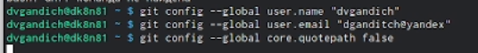
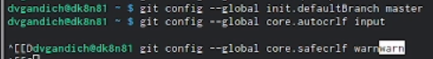
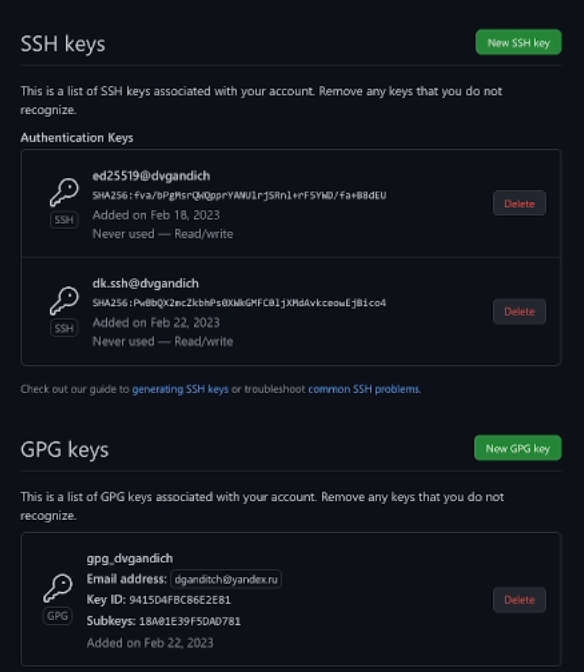
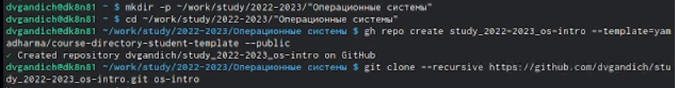
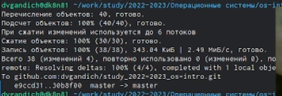

---
## Front matter
lang: ru-RU
title: Лабороторная работа №2
subtitle: Первоначальная настройка git
author:
  - Гандич Дарья Владимировна
institute:
  - Российский университет дружбы народов, Москва, Россия
date: 25 февраля 2023 г.

## i18n babel
babel-lang: russian
babel-otherlangs: english

## Formatting pdf
toc: false
toc-title: Содержание
slide_level: 2
aspectratio: 169
section-titles: true
theme: metropolis
header-includes:
 - \metroset{progressbar=frametitle,sectionpage=progressbar,numbering=fraction}
 - '\makeatletter'
 - '\beamer@ignorenonframefalse'
 - '\makeatother'
---

# Информация

## Докладчик

:::::::::::::: {.columns align=center}
::: {.column width="70%"}

  * Гандич Дарья Владимировна
  * студентка группы НБИбд-02-22
  * Российский университет дружбы народов
  
:::
::: {.column width="30%"}

:::
::::::::::::::

# Вводная часть

## Цели и задачи

Изучить идеологию и применение средств контроля версий и освоить умения по работе с git.

## Содержание исследования

1. Зададим имя и email владельца репозитория и настроим utf-8 в выводе сообщений git
{ #fig:001 width=90% }

##

2. Зададим имя начальной ветки (master) и подключим параметры autocrlf и safecrlf
{ #fig:002 width=90% }

##

3. Создадим ключи: два ключа вида ssh по алгоритмам rsa и ed25519 и добавим их в аккаунт на гитхабе
{ #fig:007 width=90% }

##

4. Настраиваем автоматические подписи коммитов git
{ #fig:008 width=90% }

##

5. Настраиваем gh
{ #fig:009 width=90% }

##

6. Создаем личный репозиторий для дисциплины "Операционные системы".
{ #fig:010 width=90% }

##

8. Выгружаем все созданные файлы и каталоги на github
{ #fig:012 width=90% }

## Результаты

- Создали личный репозиторий для дисциплины "Операционные системы".
- Настроили репозитории для дальнейшего взаимодействия с лабороторными и пр.

## Итоговый слайд

Настроили файлы, включили gh, вот и гитхаб наш!

:::

