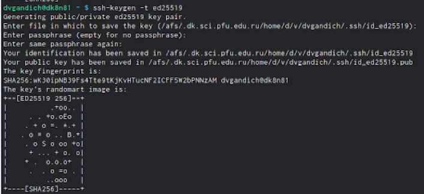
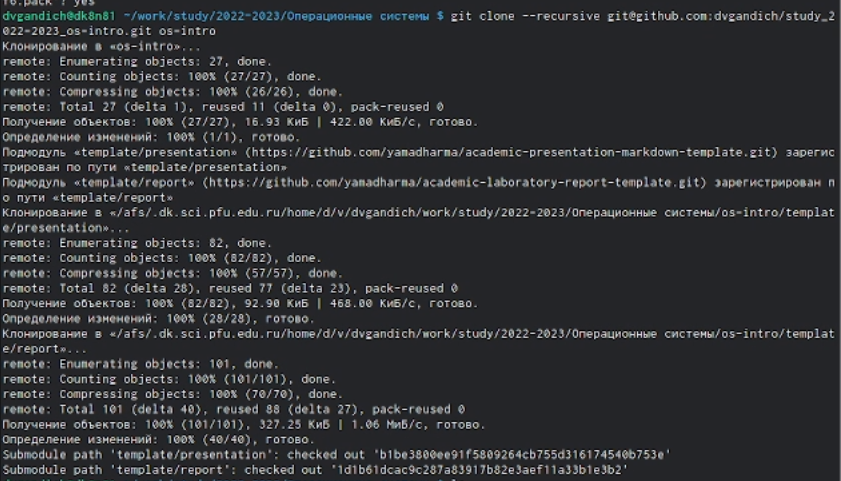

---
## Front matter
title: "Отчёта по лабораторной работе №2."
subtitle: "Первоначальная настройка git"
author: " Гандич Дарья Владимировна. НБИбд-02-22."

## Generic otions
lang: ru-RU
toc-title: "Содержание"

## Bibliography
bibliography: bib/cite.bib
csl: pandoc/csl/gost-r-7-0-5-2008-numeric.csl

## Pdf output format
toc: true # Table of contents
toc-depth: 2
lof: true # List of figures
lot: true # List of tables
fontsize: 12pt
linestretch: 1.5
papersize: a4
documentclass: scrreprt
## I18n polyglossia
polyglossia-lang:
 name: russian
 options:
 - spelling=modern
 - babelshorthands=true
polyglossia-otherlangs:
 name: english
## I18n babel
babel-lang: russian
babel-otherlangs: english
## Fonts
mainfont: PT Serif
romanfont: PT Serif
sansfont: PT Sans
monofont: PT Mono
mainfontoptions: Ligatures=TeX
romanfontoptions: Ligatures=TeX
sansfontoptions: Ligatures=TeX,Scale=MatchLowercase
monofontoptions: Scale=MatchLowercase,Scale=0.9
## Biblatex
biblatex: true
biblio-style: "gost-numeric"
biblatexoptions:
 - parentracker=true
 - backend=biber
 - hyperref=auto
 - language=auto
 - autolang=other*
 - citestyle=gost-numeric
## Pandoc-crossref LaTeX customization
figureTitle: "Рис."
tableTitle: "Таблица"
listingTitle: "Листинг"
lofTitle: "Список иллюстраций"
lolTitle: "Листинги"
## Misc options
indent: true
header-includes:
 - \usepackage{indentfirst}
 - \usepackage{float} # keep figures where there are in the text
 - \floatplacement{figure}{H} # keep figures where there are in the text
---

# Цель работы

Изучить идеологию и применение средств контроля версий и освоить умения по работе с git.

# Выполнение лабораторной работы

1. Зададим имя и email владельца репозитория и настроим utf-8 в выводе сообщений git

{ #fig:001 width=90% }

2. Зададим имя начальной ветки (master) и подключим параметры autocrlf и safecrlf

{ #fig:002 width=90% }

3. Создадим ключи: два ключа вида ssh по алгоритмам rsa и ed25519.

{ #fig:003 width=90% }

{ #fig:004 width=90% }

{ #fig:005 width=90% }

{ #fig:006 width=90% }

4. Добавляем созданные ключи на гитхаб.

{ #fig:007 width=90% }

5. Настраиваем автоматические подписи коммитов git

{ #fig:008 width=90% }

6. Настраиваем gh

{ #fig:009 width=90% }

7. Используя шаблон для рабочего пространства на ТУИС создаем на его основе личный репозиторий для дисциплины "Операционные системы".

{ #fig:010 width=90% }

{ #fig:011 width=90% }

8. Выгружаем все созданные файлы и каталоги на github с помощью известных нам команд "git add .", "gir commit" и "git push".

{ #fig:012 width=90% }

# Вывод

В течение выполнения данной лабораторной работы мы изучили идеологию и применение средств контроля версий, также приобрели практические навыки по работе с системой git.

::: {#refs}
:::
