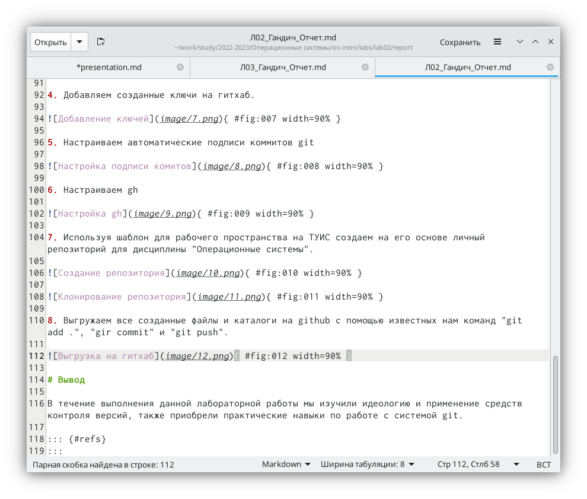

---
## Front matter
lang: ru-RU
title: Лабороторная работа №3
subtitle: Markdown
author:
  - Гандич Дарья Владимировна
institute:
  - Российский университет дружбы народов, Москва, Россия
date: 25 февраля 2023 г.

## i18n babel
babel-lang: russian
babel-otherlangs: english

## Formatting pdf
toc: false
toc-title: Содержание
slide_level: 2
aspectratio: 169
section-titles: true
theme: metropolis
header-includes:
 - \metroset{progressbar=frametitle,sectionpage=progressbar,numbering=fraction}
 - '\makeatletter'
 - '\beamer@ignorenonframefalse'
 - '\makeatother'
---

# Информация

## Докладчик

:::::::::::::: {.columns align=center}
::: {.column width="70%"}

  * Гандич Дарья Владимировна
  * студентка группы НБИбд-02-22
  * Российский университет дружбы народов
  
:::
::: {.column width="30%"}

:::
::::::::::::::

# Вводная часть

## Цели и задачи

Научиться оформлять отчёты с помощью легковесного языка разметки Markdown.

## Содержание исследования

1. Создаем отчет по лабораторной работе №2 и рассмотрим особенности разметки markdown
{ #fig:001 width=90% }

##

2. Заголовки в markdown создаются с помощью символа #
{ #fig:002 width=90% }

##

3. Маркированный список создается с помощью знаков - стоящих на одном уровне абзаца
{ #fig:003 width=90% }

##

4. Упорядоченный список создается с помощью нумерации стоящей на одном уровне строки
{ #fig:004 width=90% }

##

5. Рассмотрим строение ссылки на фотографию: в квадратных скобках находится подпись рисунка, в круглых путь к изображению, в фигурных - параметры изображения
{ #fig:005 width=90% }

##

6. Конвертировать md файл мы можем с помощью команды make.
{ #fig:006 width=90% }

## Результаты

- Освоили принципы разметки языка Markdown
- Создали отчет по ЛР №2

## Итоговый слайд

Markdown упрощает работу с тектовыми документами и разметкой, помогает быстро и качественно составлять большие файлы, отчеты и т.п.

:::

