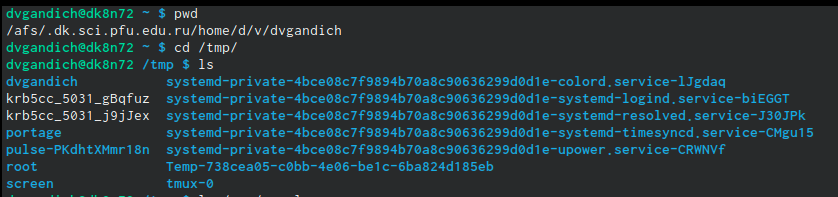
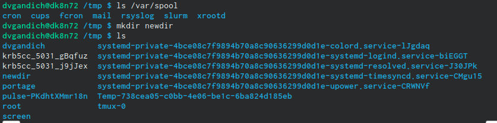
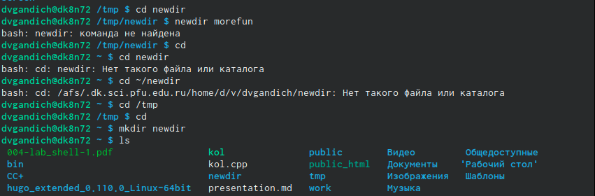
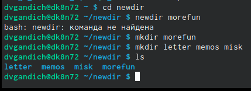
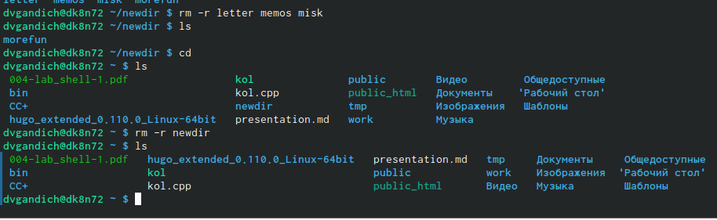
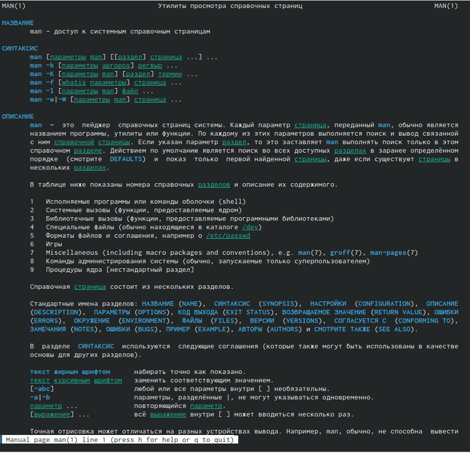

---
## Front matter
lang: ru-RU
title: Лабороторная работа №4
subtitle: Основы интерфейса взаимодействия пользователя с системой Unix на уровне командной строки
author:
  - Гандич Дарья Владимировна
institute:
  - Российский университет дружбы народов, Москва, Россия
date: 3 марта 2023 г.

## i18n babel
babel-lang: russian
babel-otherlangs: english

## Formatting pdf
toc: false
toc-title: Содержание
slide_level: 2
aspectratio: 169
section-titles: true
theme: metropolis
header-includes:
 - \metroset{progressbar=frametitle,sectionpage=progressbar,numbering=fraction}
 - '\makeatletter'
 - '\beamer@ignorenonframefalse'
 - '\makeatother'
---

# Информация

## Докладчик

:::::::::::::: {.columns align=center}
::: {.column width="70%"}

  * Гандич Дарья Владимировна
  * студентка группы НБИбд-02-22
  * Российский университет дружбы народов
  
:::
::: {.column width="30%"}

:::
::::::::::::::

# Вводная часть

## Цели и задачи

Приобретение практических навыков взаимодействия пользователя с системой посредством командной строки.

## Содержание исследования

1. Узнаем полный путь к домашнему каталогу и перейдем в каталог tmp и выведем его содержимое на экран
{ #fig:001 width=90% }

##

2. Проверяем каталог /var/spool на наличие подкаталога cron
{ #fig:002 width=90% }

##

3. Создадим новый каталог newdir
{ #fig:003 width=90% }

##

4. Создаем три новых каталога одной командой
{ #fig:004 width=90% }

##

5. Теперь удалим созданные каталоги и каталог newdir из домашнего каталога
{ #fig:005 width=90% }

##

6. С помощью команды man просмотрим подкаталоги, входящие в основные каталоги (man, cd, ls, mkdir, rmdir, rm)
{ #fig:006 width=90% }

##

7. Просматриваем историю буфера команд консоли с помощью команды history 
{ #fig:013 width=90% }

## Результаты

- Мы повторили основные команды интерфейса взаимодействия
пользователя с системой Unix.

## Итоговый слайд

Командная строка помогает нам взаимодействовать с системрй бытрее, выполнять многие команды в одно действие и терминал экономит наше время и наши силы!
:::

