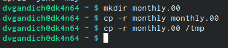

---
## Front matter
lang: ru-RU
title: Лабороторная работа №5
subtitle: Анализ файловой системы Linux. Команды для работы с файлами и каталогами
author:
  - Гандич Дарья Владимировна
institute:
  - Российский университет дружбы народов, Москва, Россия
date: 9 марта 2023 г.

## i18n babel
babel-lang: russian
babel-otherlangs: english

## Formatting pdf
toc: false
toc-title: Содержание
slide_level: 2
aspectratio: 169
section-titles: true
theme: metropolis
header-includes:
 - \metroset{progressbar=frametitle,sectionpage=progressbar,numbering=fraction}
 - '\makeatletter'
 - '\beamer@ignorenonframefalse'
 - '\makeatother'
---

# Информация

## Докладчик

:::::::::::::: {.columns align=center}
::: {.column width="70%"}

  * Гандич Дарья Владимировна
  * студентка группы НБИбд-02-22
  * Российский университет дружбы народов
  
:::
::: {.column width="30%"}

:::
::::::::::::::

# Вводная часть

## Цели и задачи

Ознакомление с файловой системой Linux, её структурой, именами и содержанием каталогов. Приобретение практических навыков по применению команд для работы с файлами и каталогами, по управлению процессами (и работами), по проверке использования диска и обслуживанию файловой системы

## Содержание исследования

1. Пример 1 из ЛР
{ #fig:001 width=90% }

##

2. Пример 2 из ЛР
{ #fig:002 width=90% }

##

3. Пример 3 из ЛР
{ #fig:003 width=90% }

##

4. Пример 4 из ЛР
{ #fig:004 width=90% }

##

5. Выполняем пункт 2 из текста ЛР, вспоминаем работу команд cp и mv
{ #fig:005 width=90% }

##

6. Присваиваем файлам australia, play, my_os, feathers права доступа, указанные в ЛР
{ #fig:006 width=90% }

##

7. Меняем права доступа к файлам play и feathers
{ #fig:009 width=90% }

##

8. Читаем man по командам mount, fsck, mkfs, kill
{ #fig:014 width=90% }
{ #fig:010 width=90% }
## Результаты

- Мы повторили команды для взаимодействия с файлами и каталогами (mv, cp, mkdir), разобрались с тем, как работают и как изменять права доступа.

## Итоговый слайд

Командная строка помогает нам взаимодействовать с системой бытрее, выполнять многие команды в одно действие и терминал экономит наше время и наши силы!
:::

