---
## Front matter
title: "Отчёта по лабораторной работе №5."
subtitle: "Анализ файловой системы Linux. Команды для работы с файлами и каталогами"
author: " Гандич Дарья Владимировна. НБИбд-02-22."

## Generic otions
lang: ru-RU
toc-title: "Содержание"

## Bibliography
bibliography: bib/cite.bib
csl: pandoc/csl/gost-r-7-0-5-2008-numeric.csl

## Pdf output format
toc: true # Table of contents
toc-depth: 2
lof: true # List of figures
lot: true # List of tables
fontsize: 12pt
linestretch: 1.5
papersize: a4
documentclass: scrreprt
## I18n polyglossia
polyglossia-lang:
 name: russian
 options:
 - spelling=modern
 - babelshorthands=true
polyglossia-otherlangs:
 name: english
## I18n babel
babel-lang: russian
babel-otherlangs: english
## Fonts
mainfont: PT Serif
romanfont: PT Serif
sansfont: PT Sans
monofont: PT Mono
mainfontoptions: Ligatures=TeX
romanfontoptions: Ligatures=TeX
sansfontoptions: Ligatures=TeX,Scale=MatchLowercase
monofontoptions: Scale=MatchLowercase,Scale=0.9
## Biblatex
biblatex: true
biblio-style: "gost-numeric"
biblatexoptions:
 - parentracker=true
 - backend=biber
 - hyperref=auto
 - language=auto
 - autolang=other*
 - citestyle=gost-numeric
## Pandoc-crossref LaTeX customization
figureTitle: "Рис."
tableTitle: "Таблица"
listingTitle: "Листинг"
lofTitle: "Список иллюстраций"
lolTitle: "Листинги"
## Misc options
indent: true
header-includes:
 - \usepackage{indentfirst}
 - \usepackage{float} # keep figures where there are in the text
 - \floatplacement{figure}{H} # keep figures where there are in the text
---

# Цель работы

Ознакомление с файловой системой Linux, её структурой, именами и содержанием каталогов. Приобретение практических навыков по применению команд для работы с файлами и каталогами, по управлению процессами (и работами), по проверке использования диска и обслуживанию файловой системы

# Выполнение лабораторной работы

1. Выполняем все примеры из текста ЛР: 1) копируем файл ~/abc1 в файл april и в файл may, 2) копируем каталог monthly в каталог monthly.00, 3) переименование файлов в текущем каталоге, 4) использование режимов команды chmod.

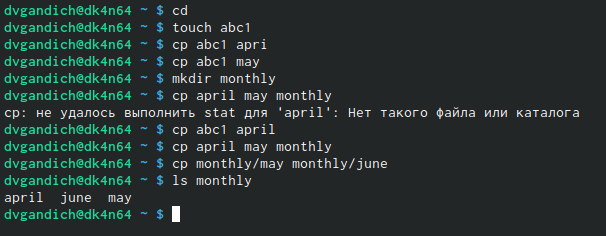{ #fig:001 width=90% }

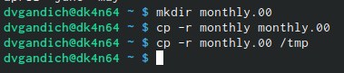{ #fig:002 width=90% }

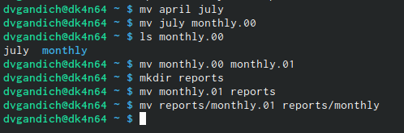{ #fig:003 width=90% }

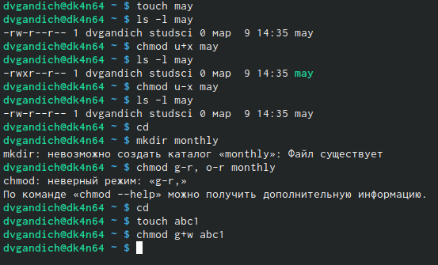{ #fig:004 width=90% }

2. Выполняем пункт 2 из текста ЛР, вспоминаем работу команд cp и mv

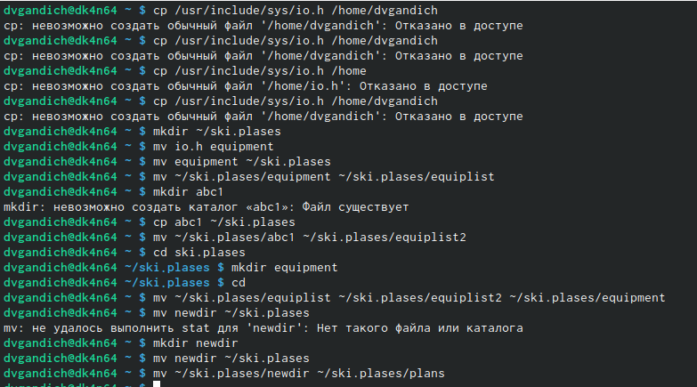{ #fig:005 width=90% }

3. Выполняем пункт 3 из текста ЛР, определяем опции команды chmod, необходимые для того, чтобы присвоить файлам australia, play, my_os, feathers выделенные права доступа. С файлами my_os и feathers достигнуть указанного права доступа не получилось.

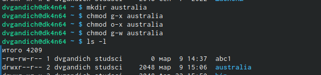{ #fig:006 width=90% }

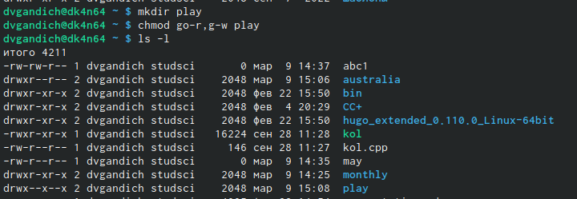{ #fig:007 width=90% }

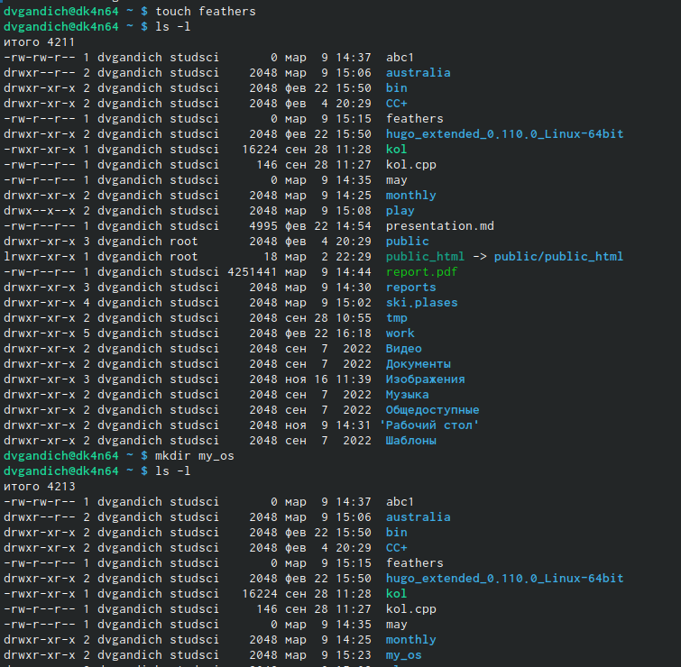{ #fig:008 width=90% }

4. Выполняем пункт 4 из текста ЛР, меняем права доступа к файлам play и feathers

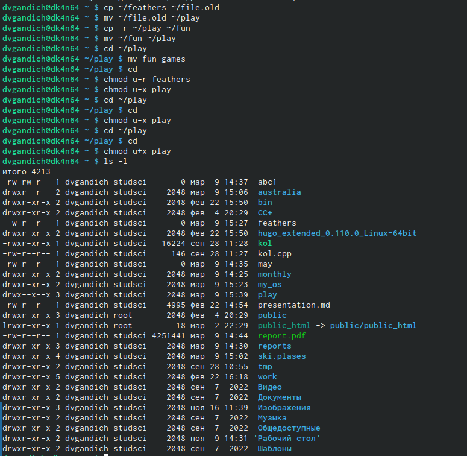{ #fig:009 width=90% }

5. Выполняем пункт 5 из текста ЛР, читаем man по командам mount, fsck, mkfs, kill

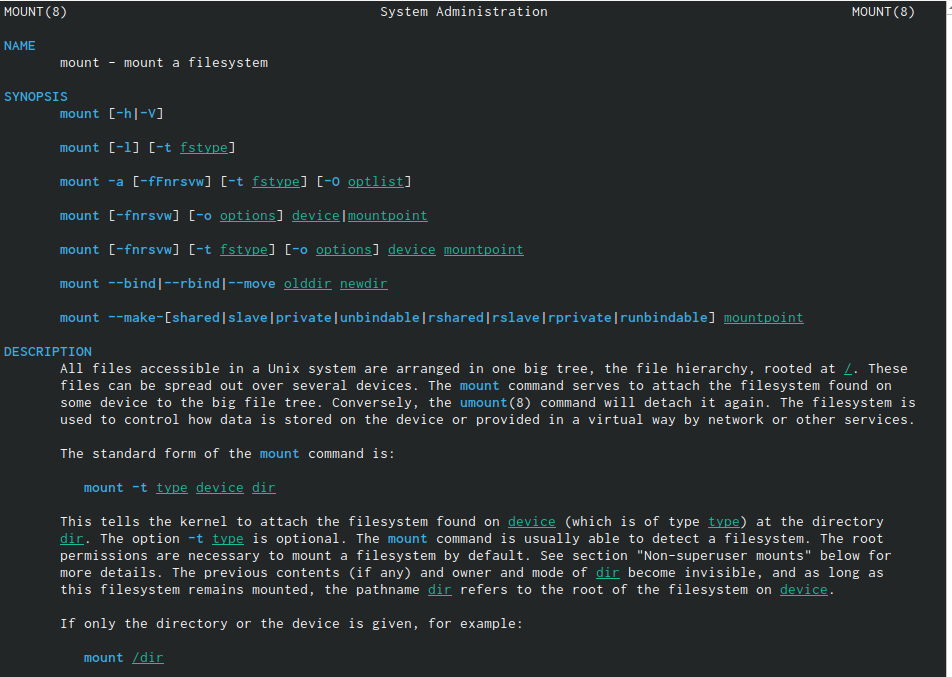{ #fig:010 width=90% }

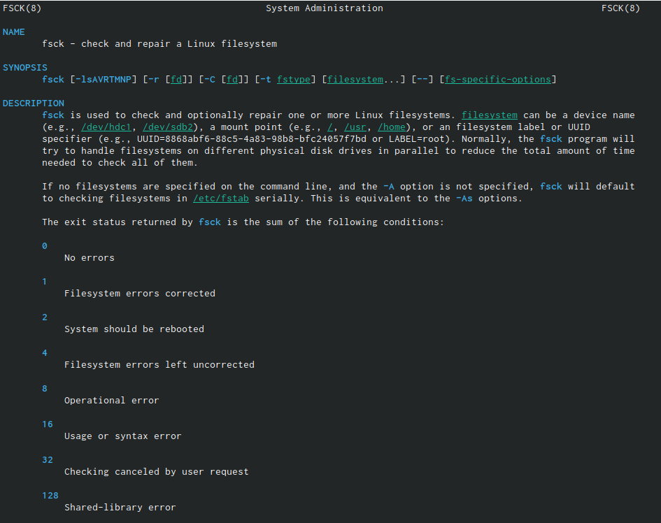{ #fig:011 width=90% }

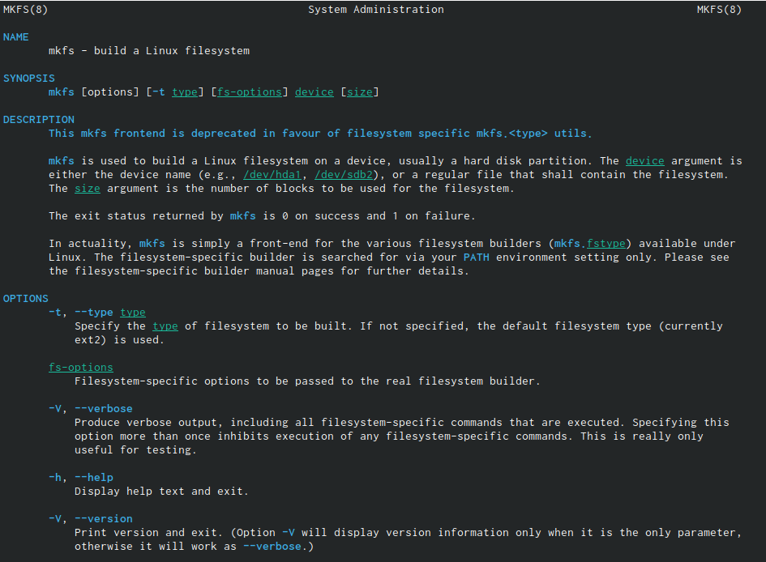{ #fig:012 width=90% }

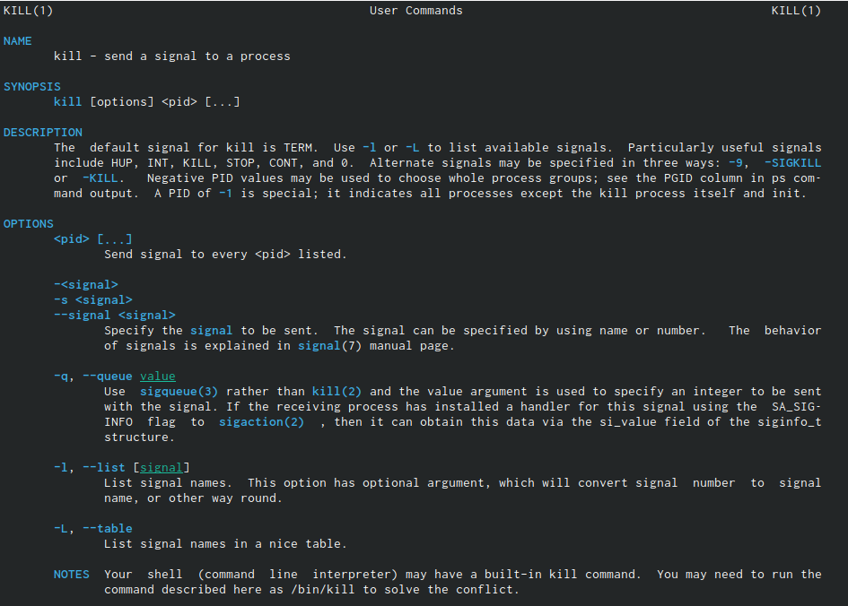{ #fig:013 width=90% }

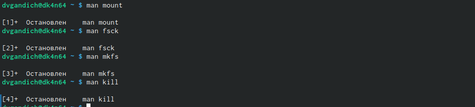{ #fig:014 width=90% }

6. Краткая характеристика: -mount применяется для монтирования файловых систем, -fsck восстанавливает поврежденную файловую систему или проверяет на целостность, -mkfs создает новую файловую систему, -kill используется для принудительного завершения работы приложений.

# Вывод

Мы повторили команды для взаимодействия с файлами и каталогами (mv, cp, mkdir), разобрались с тем, как работают и как изменять права доступа

::: {#refs}
:::
