---
## Front matter
lang: ru-RU
title: Лабороторная работа №6
subtitle: Анализ файловой системы Linux. Команды для работы с файлами и каталогами
author:
  - Гандич Дарья Владимировна
institute:
  - Российский университет дружбы народов, Москва, Россия
date: 14 марта 2023 г.

## i18n babel
babel-lang: russian
babel-otherlangs: english

## Formatting pdf
toc: false
toc-title: Содержание
slide_level: 2
aspectratio: 169
section-titles: true
theme: metropolis
header-includes:
 - \metroset{progressbar=frametitle,sectionpage=progressbar,numbering=fraction}
 - '\makeatletter'
 - '\beamer@ignorenonframefalse'
 - '\makeatother'
---

# Информация

## Докладчик

:::::::::::::: {.columns align=center}
::: {.column width="70%"}

  * Гандич Дарья Владимировна
  * студентка группы НБИбд-02-22
  * Российский университет дружбы народов
  
:::
::: {.column width="30%"}

:::
::::::::::::::

# Вводная часть

## Цели и задачи

Ознакомление с инструментами поиска файлов и фильтрации текстовых данных. Приобретение практических навыков: по управлению процессами (и заданиями), по проверке использования диска и обслуживанию файловых систем.

## Содержание исследования

1. Пункт 1, 2 

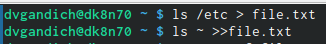{ #fig:001 width=90% }

##

2. Пункт 3 

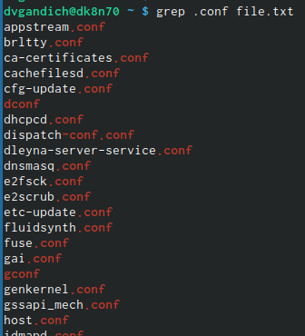{ #fig:002 width=90% }

##

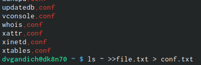{ #fig:003 width=90% }

##

3. Пункт 4 

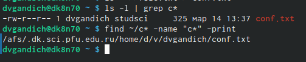{ #fig:004 width=90% }

##

4. Пункт 5 

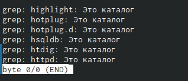{ #fig:007 width=90% }

##

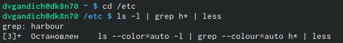{ #fig:008 width=90% }

##

5. Пункт 6, 7 

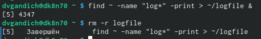{ #fig:009 width=90% }

##

6. Пункт 8, 9

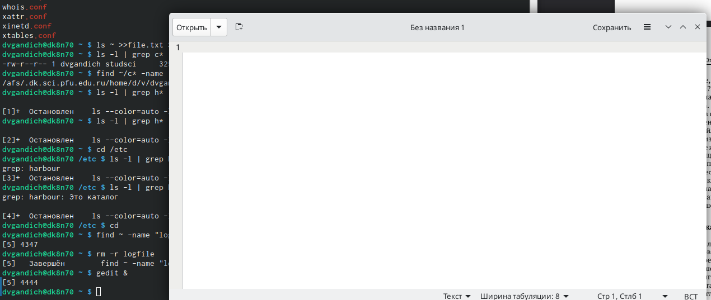{ #fig:010 width=90% }

##

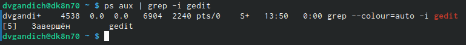{ #fig:011 width=90% }

## 

7. Пункт 10

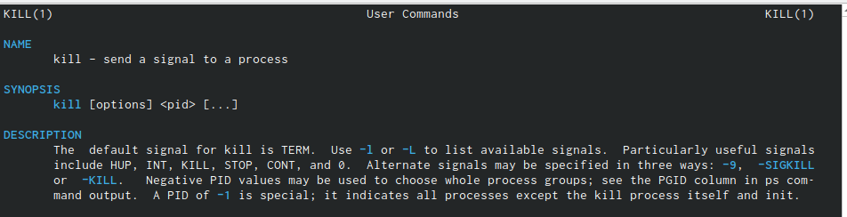{ #fig:012 width=90% }

##

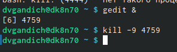{ #fig:014 width=90% }

##

8. Пункт 11

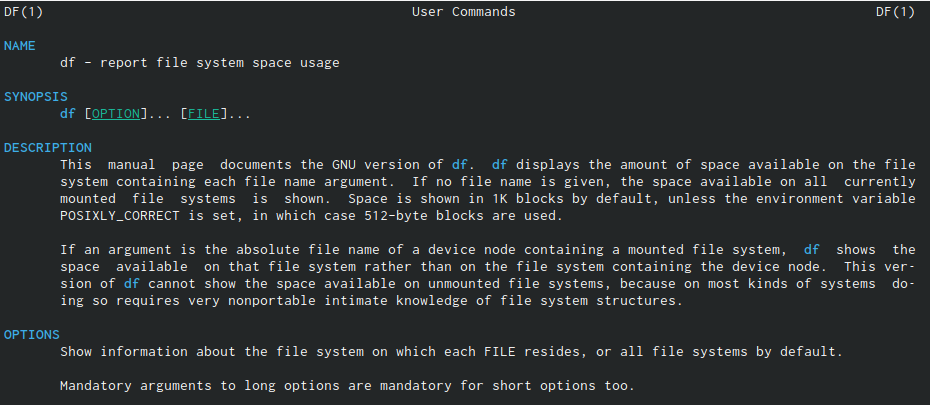{ #fig:015 width=90% }

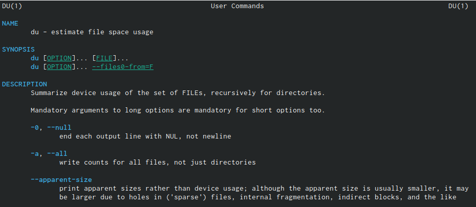{ #fig:016 width=90% }

##

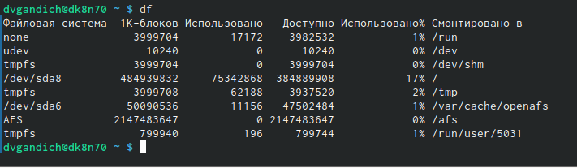{ #fig:018 width=90% }

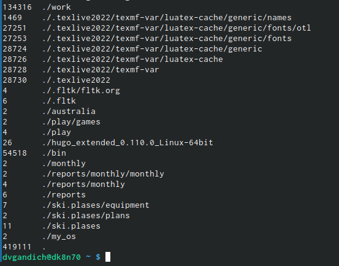{ #fig:019 width=90% }

## 

9. Пункт 12

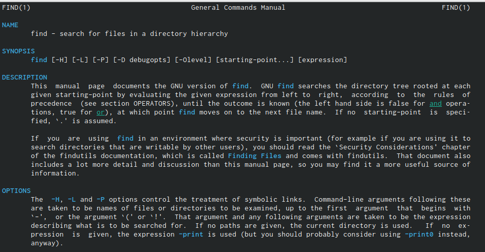{ #fig:020 width=90% }

##

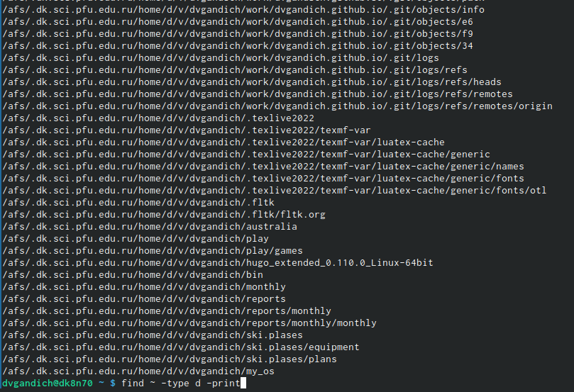{ #fig:021 width=90% }

## Результаты

- Мы ознакомились с инструментами поиска файлов и фильтрации текстовых данных, воспользовались ими на практике.

## Итоговый слайд

Командная строка помогает нам взаимодействовать с системой бытрее, выполнять многие команды в одно действие и терминал экономит наше время и наши силы!
:::
