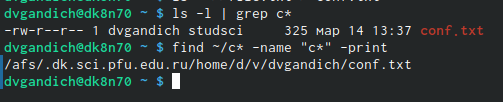

---
## Front matter
title: "Отчёта по лабораторной работе №6."
subtitle: "Поиск файлов. Перенаправление ввода-вывода. Просмотр запущенных процессов"
author: " Гандич Дарья Владимировна. НБИбд-02-22."

## Generic otions
lang: ru-RU
toc-title: "Содержание"

## Bibliography
bibliography: bib/cite.bib
csl: pandoc/csl/gost-r-7-0-5-2008-numeric.csl

## Pdf output format
toc: true # Table of contents
toc-depth: 2
lof: true # List of figures
lot: true # List of tables
fontsize: 12pt
linestretch: 1.5
papersize: a4
documentclass: scrreprt
## I18n polyglossia
polyglossia-lang:
 name: russian
 options:
 - spelling=modern
 - babelshorthands=true
polyglossia-otherlangs:
 name: english
## I18n babel
babel-lang: russian
babel-otherlangs: english
## Fonts
mainfont: PT Serif
romanfont: PT Serif
sansfont: PT Sans
monofont: PT Mono
mainfontoptions: Ligatures=TeX
romanfontoptions: Ligatures=TeX
sansfontoptions: Ligatures=TeX,Scale=MatchLowercase
monofontoptions: Scale=MatchLowercase,Scale=0.9
## Biblatex
biblatex: true
biblio-style: "gost-numeric"
biblatexoptions:
 - parentracker=true
 - backend=biber
 - hyperref=auto
 - language=auto
 - autolang=other*
 - citestyle=gost-numeric
## Pandoc-crossref LaTeX customization
figureTitle: "Рис."
tableTitle: "Таблица"
listingTitle: "Листинг"
lofTitle: "Список иллюстраций"
lolTitle: "Листинги"
## Misc options
indent: true
header-includes:
 - \usepackage{indentfirst}
 - \usepackage{float} # keep figures where there are in the text
 - \floatplacement{figure}{H} # keep figures where there are in the text
---

# Цель работы

Ознакомление с инструментами поиска файлов и фильтрации текстовых данных. Приобретение практических навыков: по управлению процессами (и заданиями), по проверке использования диска и обслуживанию файловых систем.

# Выполнение лабораторной работы

1. C помощью команды ls запишем в файл file.txt названия файлов, содержащихся в каталоге /etc и в домашнем каталоге.

{ #fig:001 width=90% }

2. С помощью команды grep выведем имена файлов из из file.txt, имеющих расширение .conf

{ #fig:002 width=90% }

3. Перепишем данные файлы в новый текстовый файл conf.txt

{ #fig:003 width=90% }

4. Выведем файлы домашнего каталога, которые имеют имена, начинающиеся с символа с. Сделаем это двумя способами: с помощью команды ls -l | grep и find.

{ #fig:004 width=90% }

5. C помощью той же команды ls -l | grep и добавлением less выведем по странично файлы в каталоге /etc, чье имя начинается на h (у меня этот файл один)

{ #fig:005 width=90% }

{ #fig:006 width=90% }

{ #fig:007 width=90% }

{ #fig:008 width=90% }

6. Запускаем в фоновом режиме процесс который будет записывать в файл ~/logfile файлы, имена которых начинаются с log, затем удалим данный файл

{ #fig:009 width=90% }

7. Запустим из консоли в фоновом режиме редактор gedit, затем определим идентификатор процесса

{ #fig:010 width=90% }

{ #fig:011 width=90% }

8. С помощью команды man получим справку о команде kill, затем воспользуемся ею для завершения процесса gedit

{ #fig:012 width=90% }

{ #fig:013 width=90% }

{ #fig:014 width=90% }

9. Выполним команды df и du, предварительно получив справку о командах с помощью команды man

{ #fig:015 width=90% }

{ #fig:016 width=90% }

{ #fig:017 width=90% }

{ #fig:018 width=90% }

{ #fig:019 width=90% }

10. Воспользовавшись справкой команды find, выведем имена всех директорий, имеющихся в домашнем каталоге

{ #fig:020 width=90% }

{ #fig:021 width=90% }

# Вывод
Мы ознакомились с инструментами поиска файлов и фильтрации текстовых данных, воспользовались ими на практике.

::: {#refs}
:::
