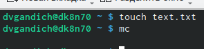
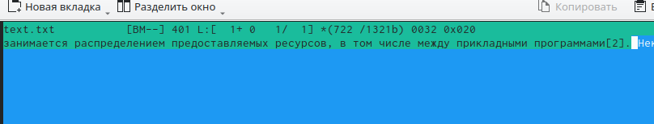
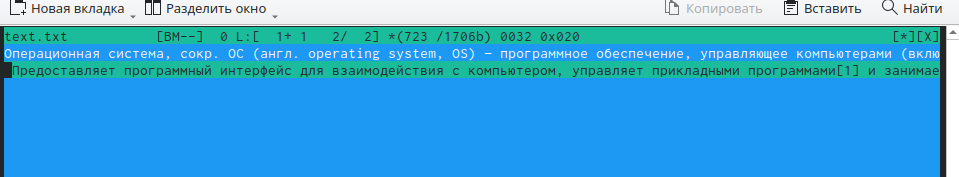
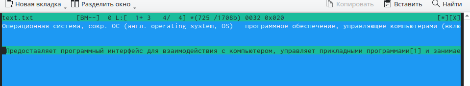
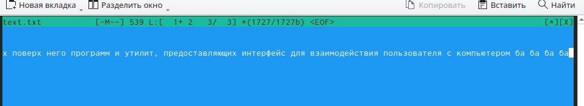
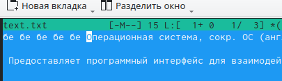
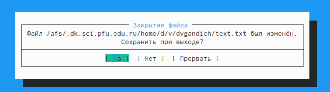
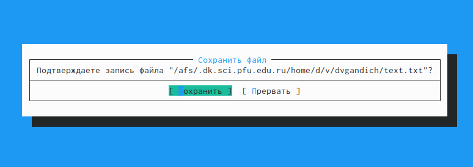
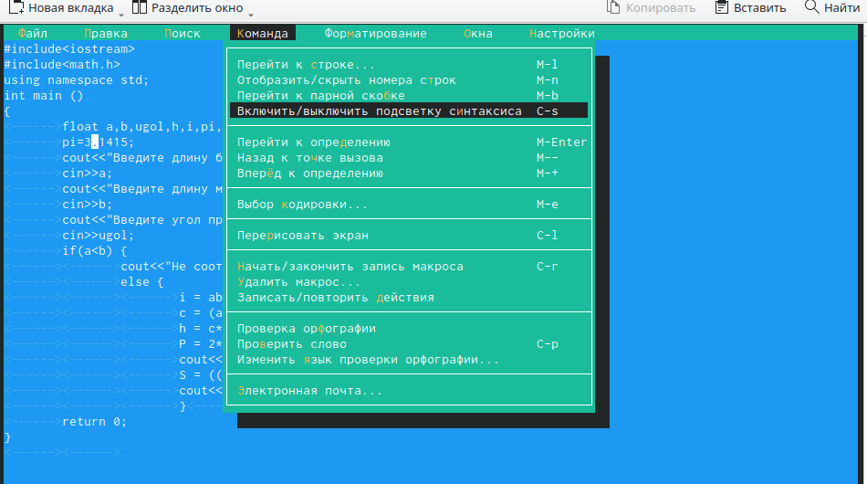

---
## Front matter
lang: ru-RU
title: Лабороторная работа №7
subtitle: Командная оболочка Midnight Commander
author:
  - Гандич Дарья Владимировна
institute:
  - Российский университет дружбы народов, Москва, Россия
date: 24 марта 2023 г.

## i18n babel
babel-lang: russian
babel-otherlangs: english

## Formatting pdf
toc: false
toc-title: Содержание
slide_level: 2
aspectratio: 169
section-titles: true
theme: metropolis
header-includes:
 - \metroset{progressbar=frametitle,sectionpage=progressbar,numbering=fraction}
 - '\makeatletter'
 - '\beamer@ignorenonframefalse'
 - '\makeatother'
---

# Информация

## Докладчик

:::::::::::::: {.columns align=center}
::: {.column width="70%"}

  * Гандич Дарья Владимировна
  * студентка группы НБИбд-02-22
  * Российский университет дружбы народов
  
:::
::: {.column width="30%"}

:::
::::::::::::::

# Вводная часть

## Цели и задачи

Освоение основных возможностей командной оболочки Midnight Commander. Приобретение навыков практической работы по просмотру каталогов и файлов; манипуляций с ними.

## Содержание исследования

1. Создаем файл text.txt и переходим в mc редактор

{ #fig:001 width=90% }

##

2. Открываем созданный файл в редакторе, вставляем какой-то текст и удаляем одну из строк (выделение - F3) с помощью горячей клавиши Ctrl+y

{ #fig:002 width=90% }

##

3. Копируем строку с помощью F5

{ #fig:003 width=90% }

##

4. Перенесем скопированный текст на другую строку с помощью F6

{ #fig:004 width=90% }

##

5. Перенесемся в конец файла с помощью клавили end и что-то напишем там

{ #fig:005 width=90% }

##

6. Теперь вернемся в самое начало файла с помощью клавиш ctrl+home и напишем здесь что-нибудь

{ #fig:006 width=90% }

##

7. Теперь нам нужно выйти и сохранить файл, для этого есть два варианта: просто нажать клавишу F10 для выхода и тогда редактор сам предложит сохранить изменения, или воспользоваться клавишей F2, а уже потом выйти. 

{ #fig:007 width=90% }

##

{ #fig:008 width=90% }

##

8. Запускаем любой файл формата .cpp и с помощью клавиши F9 меняем настройки подсветки синтаксиса

{ #fig:009 width=90% }

## Результаты

- Мы освоили основные горячие клавиши для работы с редактором mc, применили их в действии

## Итоговый слайд

мы молодцы!
:::
