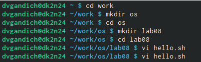
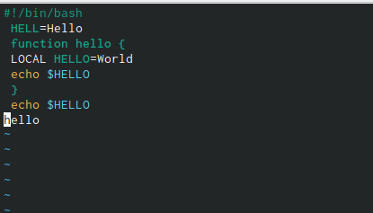
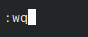
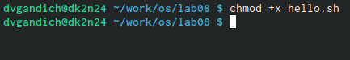
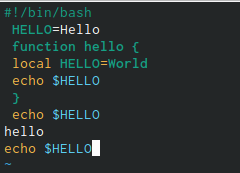
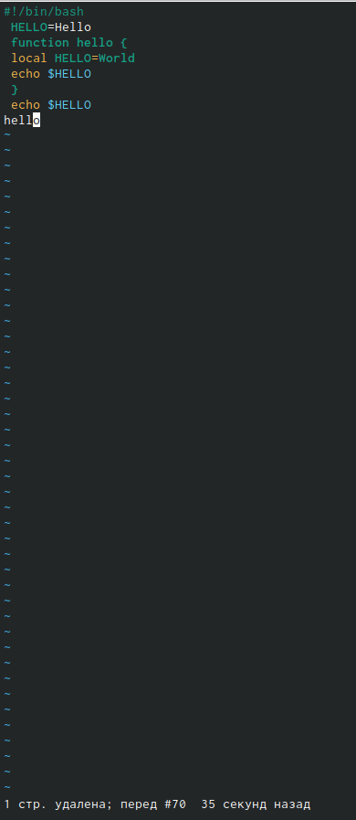

---
## Front matter
lang: ru-RU
title: Лабороторная работа №8
subtitle: Текстовой редактор vi
author:
  - Гандич Дарья Владимировна
institute:
  - Российский университет дружбы народов, Москва, Россия
date: 31 марта 2023 г.

## i18n babel
babel-lang: russian
babel-otherlangs: english

## Formatting pdf
toc: false
toc-title: Содержание
slide_level: 2
aspectratio: 169
section-titles: true
theme: metropolis
header-includes:
 - \metroset{progressbar=frametitle,sectionpage=progressbar,numbering=fraction}
 - '\makeatletter'
 - '\beamer@ignorenonframefalse'
 - '\makeatother'
---

# Информация

## Докладчик

:::::::::::::: {.columns align=center}
::: {.column width="70%"}

  * Гандич Дарья Владимировна
  * студентка группы НБИбд-02-22
  * Российский университет дружбы народов
  
:::
::: {.column width="30%"}

:::
::::::::::::::

# Вводная часть

## Цели и задачи

Познакомиться с операционной системой Linux. Получить практические навыки работы с редактором vi, установленным по умолчанию практически во всех дистрибутивах.

## Содержание исследования

1. Создаем каталог ~/work/os/lab08

{ #fig:001 width=90% }

##

2. С помощью клавиши i входим в режим вставки и вводим текст

{ #fig:002 width=90% }

##

3. Чтобы выйти из режима вставки используем клавишу Esc и записываем изменения и выходим из редактора с помощью :wq

{ #fig:003 width=90% }

##

4. Делаем файл исполняемым

{ #fig:004 width=90% }

##

5. Снова переходим в режим вставки и меняем некоторые строки текста: 1) меняем во второй строке HELL на HELLO, 2) в четвертой строке LOCAL на local, 3) добавляем последнюю строку echo $HELLO

{ #fig:005 width=90% }

##

6. Теперь нужно удалить последнюю нами созданную строку с помощью клавиши u 

{ #fig:006 width=90% }

## Результаты

- Мы познакомились с текстовым редактором vi, получили практические навыки работы с ним, разобрались с основным интерфейсом и изучили горячие клавиши для работы

## Итоговый слайд

мы молодцы!
:::
