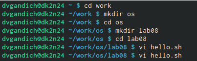
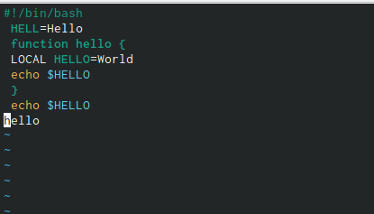
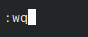
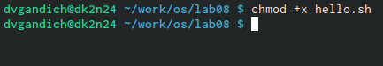
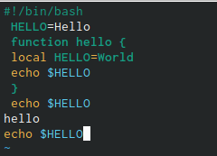
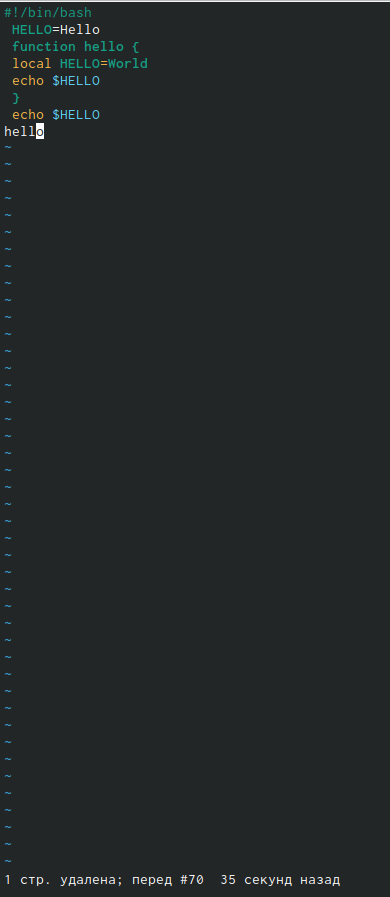

---
## Front matter
title: "Отчёта по лабораторной работе №8."
subtitle: "Текстовой редактор vi"
author: " Гандич Дарья Владимировна. НБИбд-02-22."

## Generic otions
lang: ru-RU
toc-title: "Содержание"

## Bibliography
bibliography: bib/cite.bib
csl: pandoc/csl/gost-r-7-0-5-2008-numeric.csl

## Pdf output format
toc: true # Table of contents
toc-depth: 2
lof: true # List of figures
lot: true # List of tables
fontsize: 12pt
linestretch: 1.5
papersize: a4
documentclass: scrreprt
## I18n polyglossia
polyglossia-lang:
 name: russian
 options:
 - spelling=modern
 - babelshorthands=true
polyglossia-otherlangs:
 name: english
## I18n babel
babel-lang: russian
babel-otherlangs: english
## Fonts
mainfont: PT Serif
romanfont: PT Serif
sansfont: PT Sans
monofont: PT Mono
mainfontoptions: Ligatures=TeX
romanfontoptions: Ligatures=TeX
sansfontoptions: Ligatures=TeX,Scale=MatchLowercase
monofontoptions: Scale=MatchLowercase,Scale=0.9
## Biblatex
biblatex: true
biblio-style: "gost-numeric"
biblatexoptions:
 - parentracker=true
 - backend=biber
 - hyperref=auto
 - language=auto
 - autolang=other*
 - citestyle=gost-numeric
## Pandoc-crossref LaTeX customization
figureTitle: "Рис."
tableTitle: "Таблица"
listingTitle: "Листинг"
lofTitle: "Список иллюстраций"
lolTitle: "Листинги"
## Misc options
indent: true
header-includes:
 - \usepackage{indentfirst}
 - \usepackage{float} # keep figures where there are in the text
 - \floatplacement{figure}{H} # keep figures where there are in the text
---

# Цель работы

Познакомиться с операционной системой Linux. Получить практические навыки работы с редактором vi, установленным по умолчанию практически во всех дистрибутивах.

# Выполнение лабораторной работы

1. Создаем каталог ~/work/os/lab08

{ #fig:001 width=90% }

2. С помощью клавиши i входим в режим вставки и вводим текст

{ #fig:002 width=90% }

3. Чтобы выйти из режима вставки используем клавишу Esc и записываем изменения и выходим из редактора с помощью :wq

{ #fig:003 width=90% }

4. Делаем файл исполняемым

{ #fig:004 width=90% }

5. Снова переходим в режим вставки и меняем некоторые строки текста: 1) меняем во второй строке HELL на HELLO, 2) в четвертой строке LOCAL на local, 3) добавляем последнюю строку echo $HELLO

{ #fig:005 width=90% }

6. Теперь нужно удалить последнюю нами созданную строку с помощью клавиши u 

{ #fig:006 width=90% }

# Вывод
Мы познакомились с текстовым редактором vi, получили практические навыки работы с ним, разобрались с основным интерфейсом и изучили горячие клавиши для работы

::: {#refs}
:::
