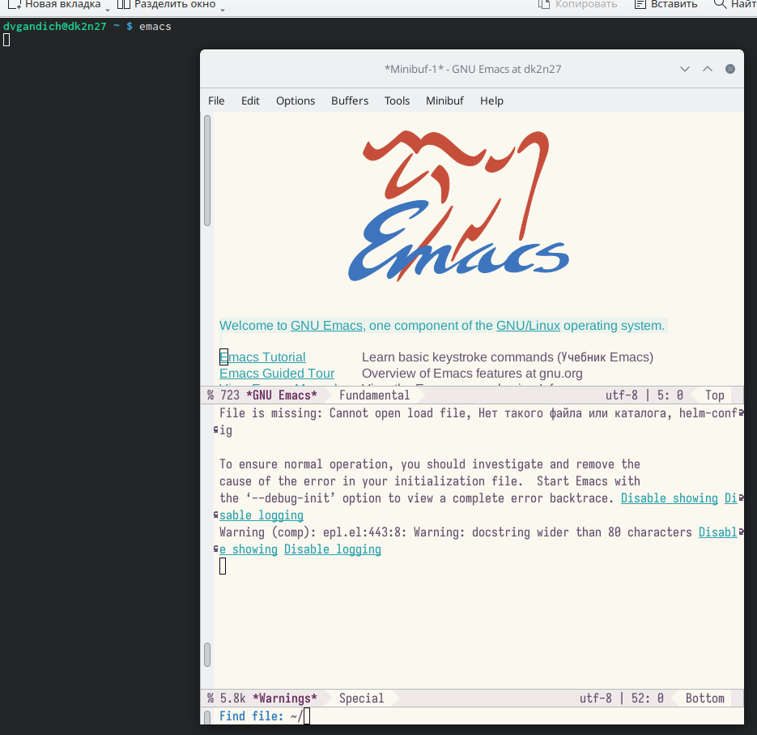
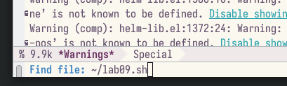
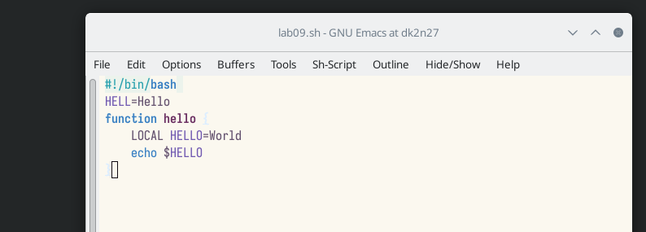
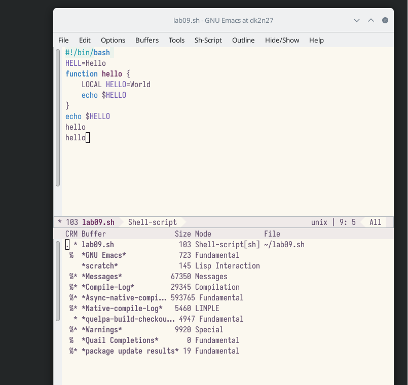
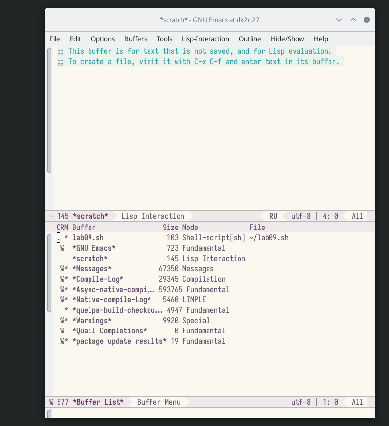
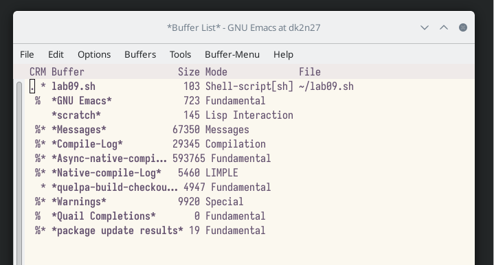
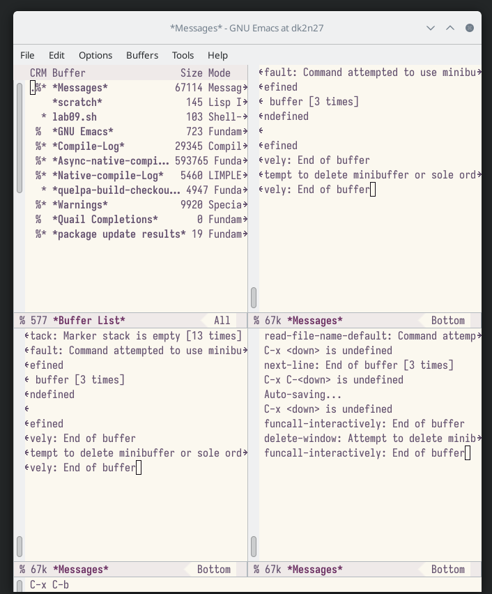
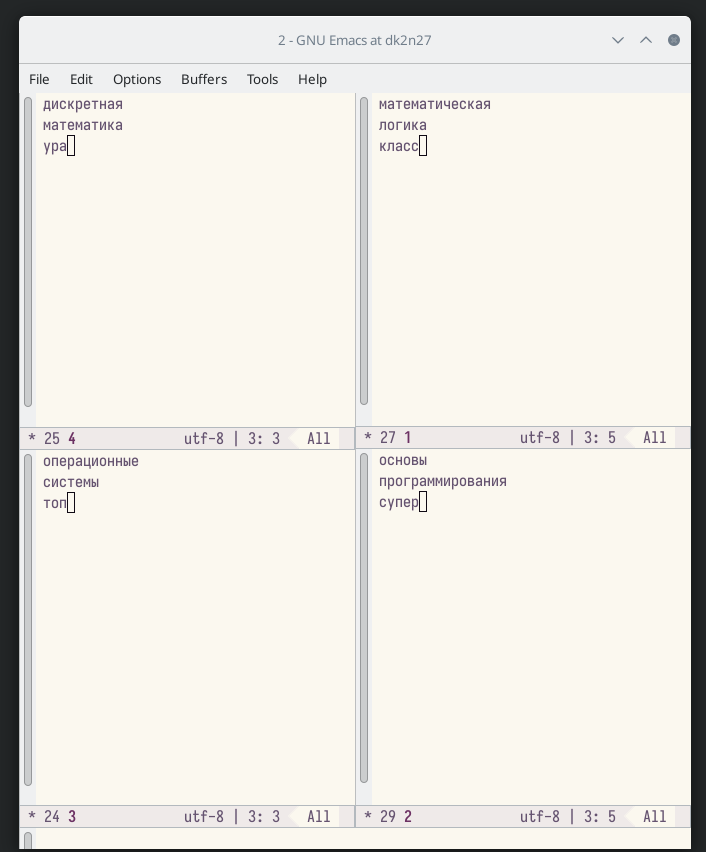
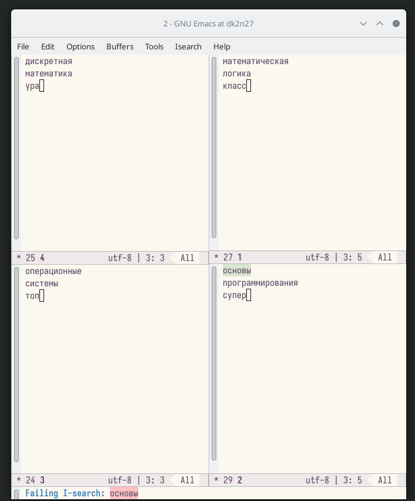
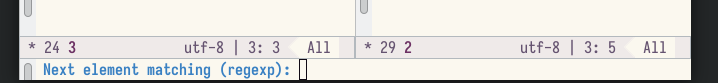

---
## Front matter
lang: ru-RU
title: Лабороторная работа №9
subtitle: Текстовой редактор emacs
author:
  - Гандич Дарья Владимировна
institute:
  - Российский университет дружбы народов, Москва, Россия
date: 5 апреля 2023 г.

## i18n babel
babel-lang: russian
babel-otherlangs: english

## Formatting pdf
toc: false
toc-title: Содержание
slide_level: 2
aspectratio: 169
section-titles: true
theme: metropolis
header-includes:
 - \metroset{progressbar=frametitle,sectionpage=progressbar,numbering=fraction}
 - '\makeatletter'
 - '\beamer@ignorenonframefalse'
 - '\makeatother'
---

# Информация

## Докладчик

:::::::::::::: {.columns align=center}
::: {.column width="70%"}

  * Гандич Дарья Владимировна
  * студентка группы НБИбд-02-22
  * Российский университет дружбы народов
  
:::
::: {.column width="30%"}

:::
::::::::::::::

# Вводная часть

## Цели и задачи

Познакомиться с операционной системой Linux. Получить практические навыки работы с редактором Emacs

## Содержание исследования

1. Открываем текстовый редактор и создаем файл lab09.sh c помощью комбинации ctrl-x, ctrl-f

{ #fig:001 width=90% }

##

{ #fig:002 width=90% }

##

2. Набираем текст из текста ЛР09 и сохраняем его

{ #fig:003 width=90% }

##

3. Проделываем с текстом стандартные процедуры редактирования, каждое действие долж-
но осуществляться комбинацией клавиш: вырезать, скопировать, вставить, выделить, отменить последнее действие, перемещение курсора (скриншоты не делала, нагляднее будет посмотреть скринкаст)

##

4. Открываем список активных буферов, переключаемся на другой в открытом окне

{ #fig:004 width=90% }

##

{ #fig:005 width=90% }

##

5. Закрываем активное окно

{ #fig:005 width=90% }

##

6. Делим фрейм на 4 части,затем создаем в каждом окне новый буфер и пишем какой-то текст

{ #fig:007 width=90% }

##

{ #fig:008 width=90% }

##

7. Пользуемся режимом поиска, их два вида

{ #fig:009 width=90% }

##

{ #fig:010 width=90% }

## Результаты

- Мы познакомились с текстовым редактором emacs, получили практические навыки работы с ним, разобрались с основным интерфейсом и изучили горячие клавиши для работы

## Итоговый слайд

мы молодцы!
:::
