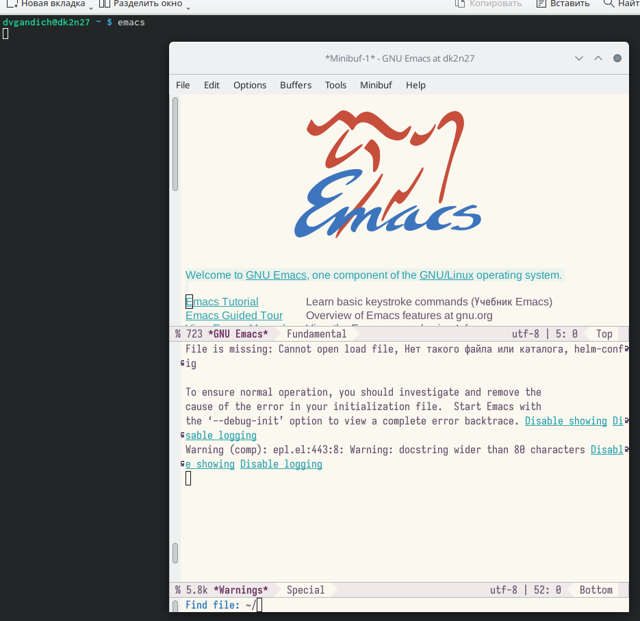
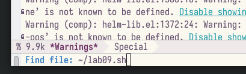
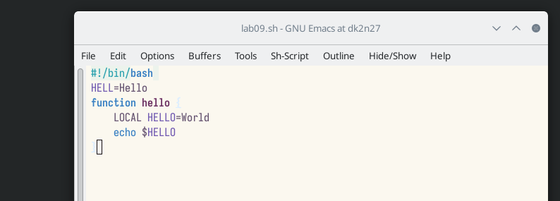
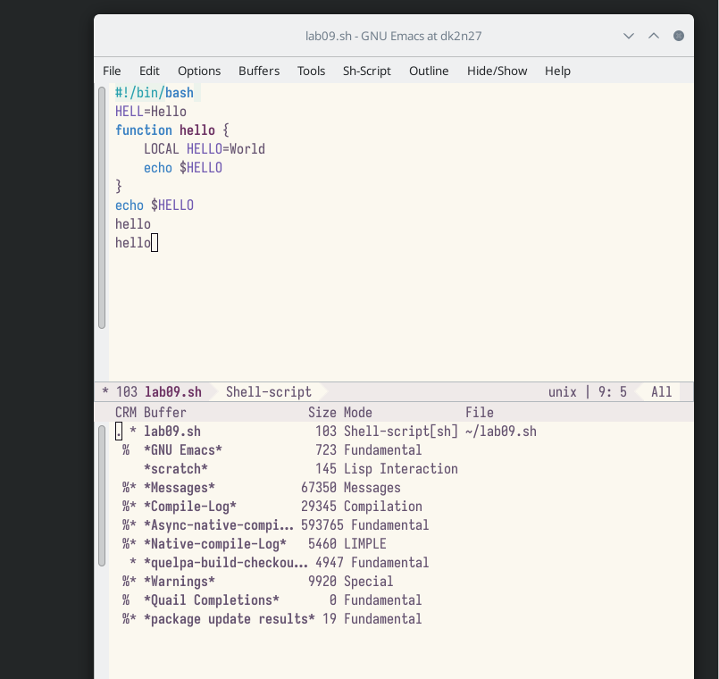
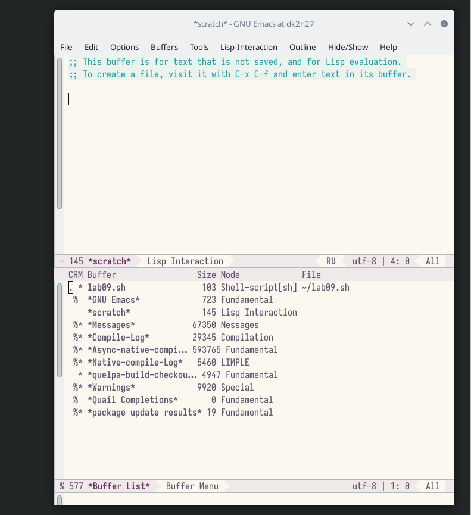
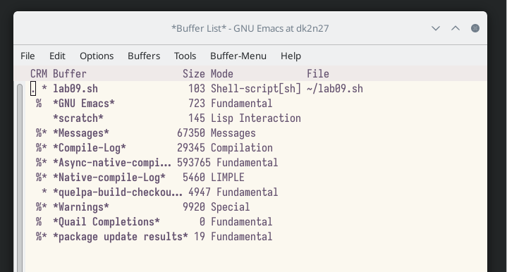
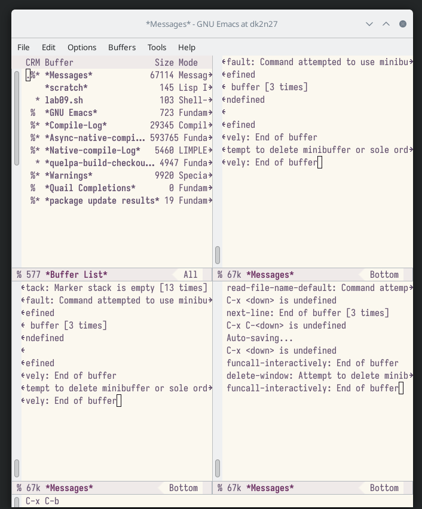
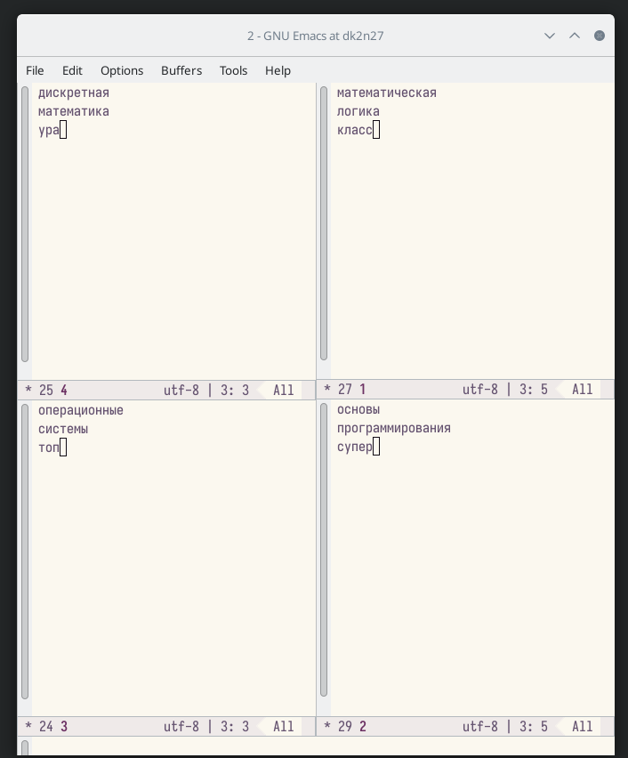
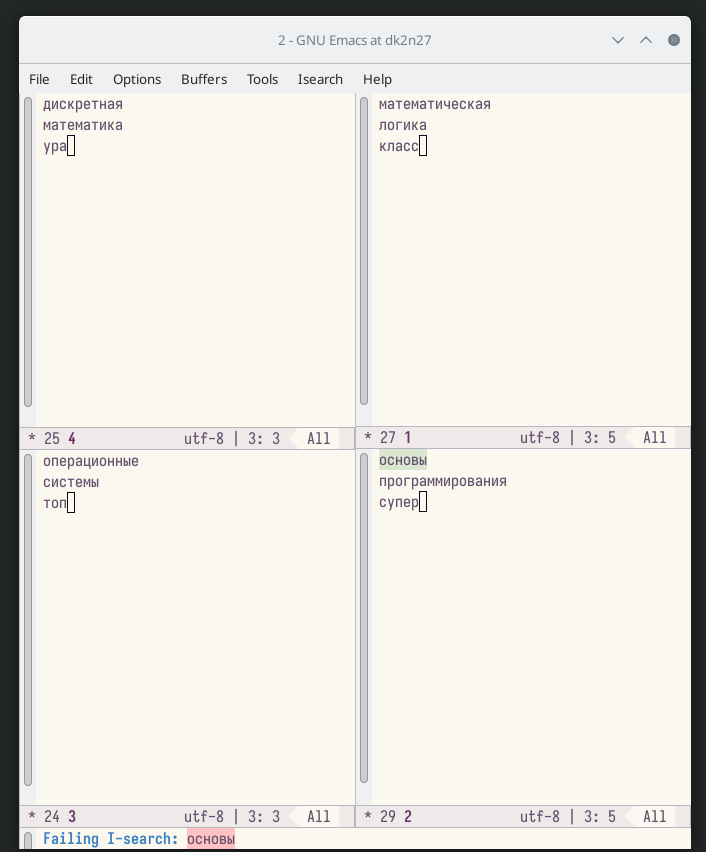
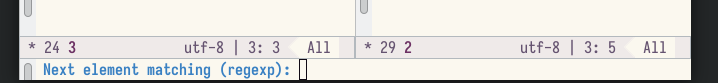

---
## Front matter
title: "Отчёта по лабораторной работе №9."
subtitle: "Текстовой редактор emacs"
author: " Гандич Дарья Владимировна. НБИбд-02-22."

## Generic otions
lang: ru-RU
toc-title: "Содержание"

## Bibliography
bibliography: bib/cite.bib
csl: pandoc/csl/gost-r-7-0-5-2008-numeric.csl

## Pdf output format
toc: true # Table of contents
toc-depth: 2
lof: true # List of figures
lot: true # List of tables
fontsize: 12pt
linestretch: 1.5
papersize: a4
documentclass: scrreprt
## I18n polyglossia
polyglossia-lang:
 name: russian
 options:
 - spelling=modern
 - babelshorthands=true
polyglossia-otherlangs:
 name: english
## I18n babel
babel-lang: russian
babel-otherlangs: english
## Fonts
mainfont: PT Serif
romanfont: PT Serif
sansfont: PT Sans
monofont: PT Mono
mainfontoptions: Ligatures=TeX
romanfontoptions: Ligatures=TeX
sansfontoptions: Ligatures=TeX,Scale=MatchLowercase
monofontoptions: Scale=MatchLowercase,Scale=0.9
## Biblatex
biblatex: true
biblio-style: "gost-numeric"
biblatexoptions:
 - parentracker=true
 - backend=biber
 - hyperref=auto
 - language=auto
 - autolang=other*
 - citestyle=gost-numeric
## Pandoc-crossref LaTeX customization
figureTitle: "Рис."
tableTitle: "Таблица"
listingTitle: "Листинг"
lofTitle: "Список иллюстраций"
lolTitle: "Листинги"
## Misc options
indent: true
header-includes:
 - \usepackage{indentfirst}
 - \usepackage{float} # keep figures where there are in the text
 - \floatplacement{figure}{H} # keep figures where there are in the text
---

# Цель работы

Познакомиться с операционной системой Linux. Получить практические навыки работы с редактором Emacs

# Выполнение лабораторной работы

1. Открываем текстовый редактор и создаем файл lab09.sh c помощью комбинации ctrl-x, ctrl-f

{ #fig:001 width=90% }

{ #fig:002 width=90% }

2. Набираем текст из текста ЛР09 и сохраняем его

{ #fig:003 width=90% }

3. Проделываем с текстом стандартные процедуры редактирования, каждое действие долж-
но осуществляться комбинацией клавиш: вырезать, скопировать, вставить, выделить, отменить последнее действие, перемещение курсора (скриншоты не делала, нагляднее будет посмотреть скринкаст)

4. Открываем список активных буферов, переключаемся на другой в открытом окне

{ #fig:004 width=90% }

{ #fig:005 width=90% }

5. Закрываем активное окно

{ #fig:005 width=90% }

6. Делим фрейм на 4 части,затем создаем в каждом окне новый буфер и пишем какой-то текст

{ #fig:007 width=90% }

{ #fig:008 width=90% }

7. Пользуемся режимом поиска, их два вида

{ #fig:009 width=90% }

{ #fig:010 width=90% }

# Вывод
Мы познакомились с текстовым редактором emacs, получили практические навыки работы с ним, разобрались с основным интерфейсом и изучили горячие клавиши для работы

::: {#refs}
:::
