---
## Front matter
lang: ru-RU
title: Лабороторная работа №10
subtitle: Программирование в командном процессоре ОС UNIX. Командные файлы
author:
  - Гандич Дарья Владимировна
institute:
  - Российский университет дружбы народов, Москва, Россия
date: 13 апреля 2023 г.

## i18n babel
babel-lang: russian
babel-otherlangs: english

## Formatting pdf
toc: false
toc-title: Содержание
slide_level: 2
aspectratio: 169
section-titles: true
theme: metropolis
header-includes:
 - \metroset{progressbar=frametitle,sectionpage=progressbar,numbering=fraction}
 - '\makeatletter'
 - '\beamer@ignorenonframefalse'
 - '\makeatother'
---

# Информация

## Докладчик

:::::::::::::: {.columns align=center}
::: {.column width="70%"}

  * Гандич Дарья Владимировна
  * студентка группы НБИбд-02-22
  * Российский университет дружбы народов
  
:::
::: {.column width="30%"}

:::
::::::::::::::

# Вводная часть

## Цели и задачи

Изучить основы программирования в оболочке ОС UNIX/Linux. Научиться писать небольшие командные файлы

## Содержание исследования

1. Создаем  файл script.sh и пишем скрипт, который при запуске будет делать резервную копию самого себя (то есть файла, в котором содержится его исходный код) в другую директорию backup в вашем домашнем каталоге. При этом файл должен архивироваться архиваторов tar. 

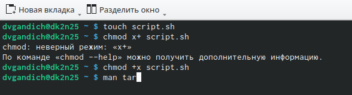{ #fig:001 width=90% }

##

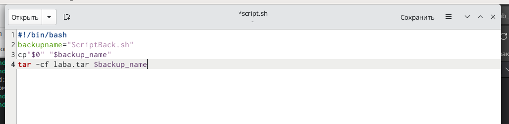{ #fig:002 width=90% }

##

2. Создаем файл script2.sh и пишем пример командного файла, обрабатывающего любое произвольное число аргументов командной строки, в том числе превышающее десять

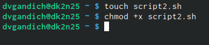{ #fig:003 width=90% }

##

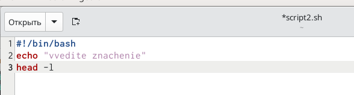{ #fig:004 width=90% }

##

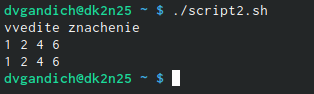{ #fig:005 width=90% }

##

3. Создаем file.sh и пишем командный файл — аналог команды ls (без использования самой этой команды и команды dir). Требуется, чтобы он выдавал информацию о нужном каталоге и выводил информацию о возможностях доступа к файлам этого каталога

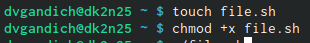{ #fig:005 width=90% }

##

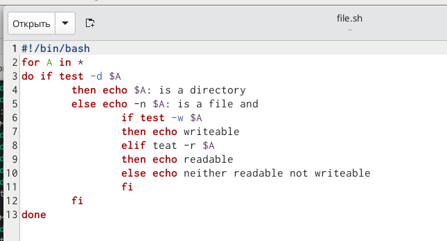{ #fig:007 width=90% }

##

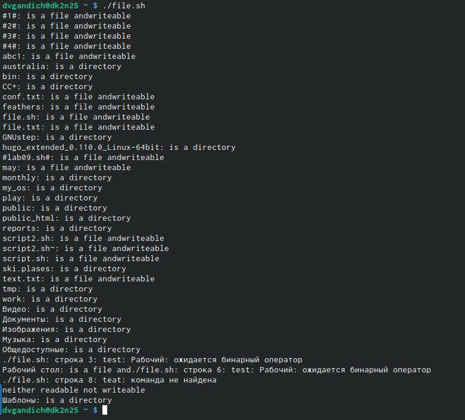{ #fig:008 width=90% }

##

4. Создаем file2.sh и пишем командный файл, который получает в качестве аргумента командной строки формат файла (.txt, .doc, .jpg, .pdf и т.д.) и вычисляет количество таких файлов в указанной директории

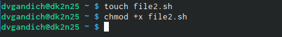{ #fig:009 width=90% }

##

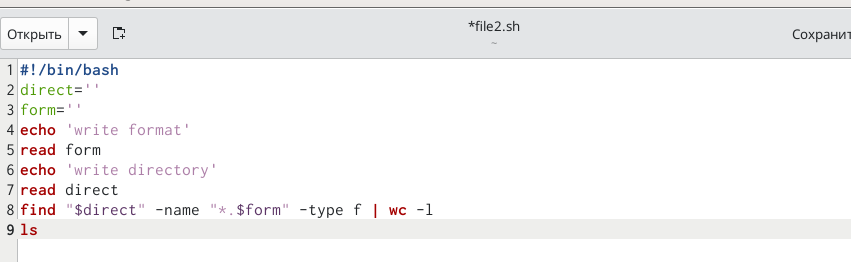{ #fig:010 width=90% }

##

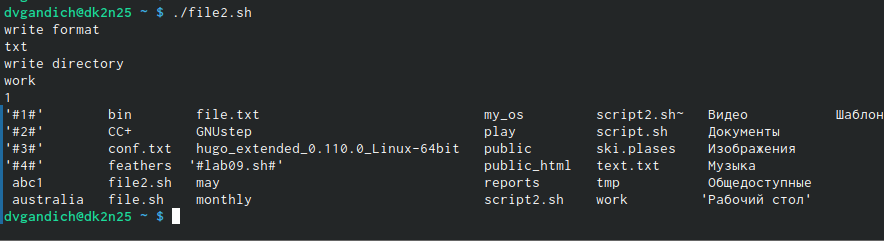{ #fig:011 width=90% }

## Результаты

- Мы изучили основы программирования в оболочке Linux, научились писать небольшие командные файлы

## Итоговый слайд

мы молодцы!
:::
