---
## Front matter
title: "Отчёта по лабораторной работе №11."
subtitle: "Программирование в командном процессоре ОС UNIX.  Ветвления и циклы"
author: " Гандич Дарья Владимировна. НБИбд-02-22."

## Generic otions
lang: ru-RU
toc-title: "Содержание"

## Bibliography
bibliography: bib/cite.bib
csl: pandoc/csl/gost-r-7-0-5-2008-numeric.csl

## Pdf output format
toc: true # Table of contents
toc-depth: 2
lof: true # List of figures
lot: true # List of tables
fontsize: 12pt
linestretch: 1.5
papersize: a4
documentclass: scrreprt
## I18n polyglossia
polyglossia-lang:
 name: russian
 options:
 - spelling=modern
 - babelshorthands=true
polyglossia-otherlangs:
 name: english
## I18n babel
babel-lang: russian
babel-otherlangs: english
## Fonts
mainfont: PT Serif
romanfont: PT Serif
sansfont: PT Sans
monofont: PT Mono
mainfontoptions: Ligatures=TeX
romanfontoptions: Ligatures=TeX
sansfontoptions: Ligatures=TeX,Scale=MatchLowercase
monofontoptions: Scale=MatchLowercase,Scale=0.9
## Biblatex
biblatex: true
biblio-style: "gost-numeric"
biblatexoptions:
 - parentracker=true
 - backend=biber
 - hyperref=auto
 - language=auto
 - autolang=other*
 - citestyle=gost-numeric
## Pandoc-crossref LaTeX customization
figureTitle: "Рис."
tableTitle: "Таблица"
listingTitle: "Листинг"
lofTitle: "Список иллюстраций"
lolTitle: "Листинги"
## Misc options
indent: true
header-includes:
 - \usepackage{indentfirst}
 - \usepackage{float} # keep figures where there are in the text
 - \floatplacement{figure}{H} # keep figures where there are in the text
---

# Цель работы

Изучить основы программирования в оболочке ОС UNIX. Научится писать более сложные командные файлы с использованием логических управляющих конструкций и циклов

# Выполнение лабораторной работы

1. Используя команды getopts grep, написать командный файл, который анализирует командную строку с ключами:
* -iinputfile — прочитать данные из указанного файла;
* -ooutputfile — вывести данные в указанный файл;
* -pшаблон — указать шаблон для поиска;
* -C — различать большие и малые буквы;
* -n — выдавать номера строк.
а затем ищет в указанном файле нужные строки, определяемые ключом -p.

2. Создаем файлы форматов txt и sh, в файл txt заносим любой текст из интернета, а в файл sh пишем специальный код, который поможет сделать файл исполняемым

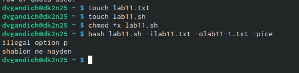{ #fig:001 width=90% }

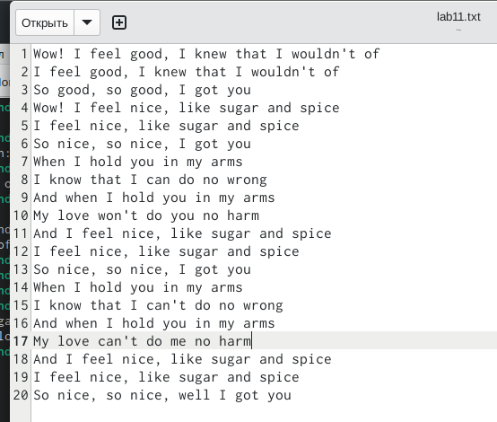{ #fig:002 width=90% }

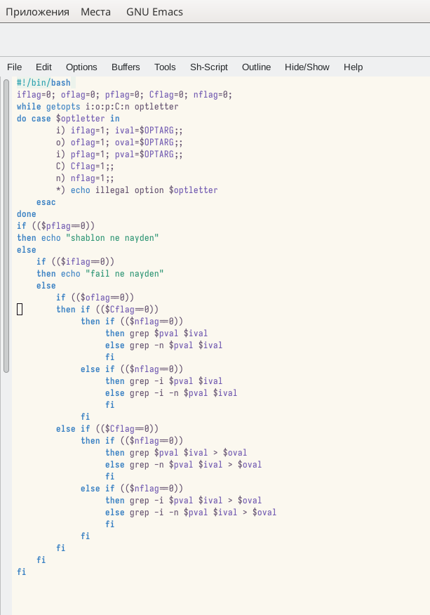{ #fig:003 width=90% }

3. Проверяем, что все сработало

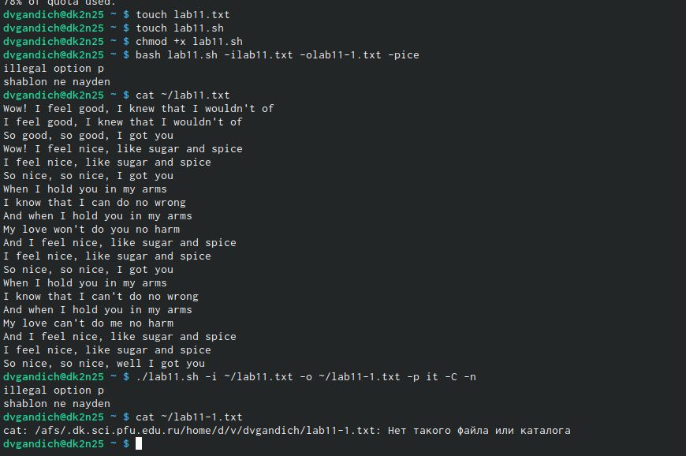{ #fig:004 width=90% }

4. Написать на языке Си программу, которая вводит число и определяет, является ли оно больше нуля, меньше нуля или равно нулю. Затем программа завершается с помощью функции exit(n), передавая информацию в о коде завершения в оболочку. Командный файл должен вызывать эту программу и, проанализировав с помощью команды $?, выдать сообщение о том, какое число было введено

5. Повторяем все дествия, что и делали ранее, только теперь создаем файл sh и c

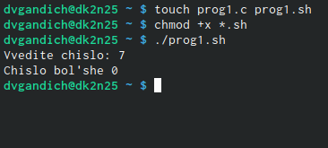{ #fig:005 width=90% }

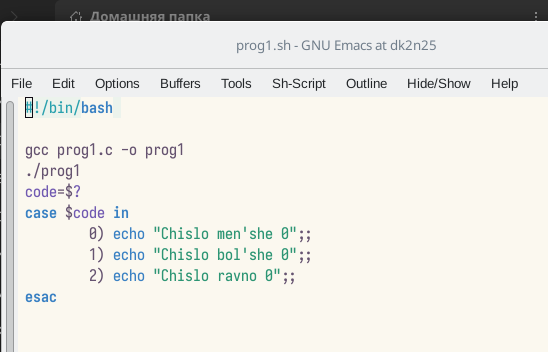{ #fig:005 width=90% }

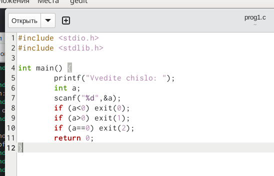{ #fig:007 width=90% }

6. Написать командный файл, создающий указанное число файлов, пронумерованных последовательно от 1 до 𝑁 (например 1.tmp, 2.tmp, 3.tmp,4.tmp и т.д.). Число файлов, которые необходимо создать, передаётся в аргументы командной строки. Этот же командный файл должен уметь удалять все созданные им файлы (если они существуют).

7. Делаем вновь то же самое, теперь создаем файл только формата sh и в качестве проверки должны создаться три файла, затем мы их удаляем

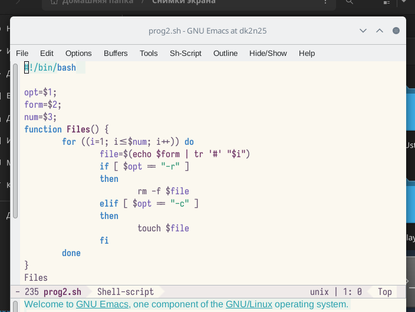{ #fig:008 width=90% }

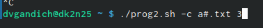{ #fig:009 width=90% }

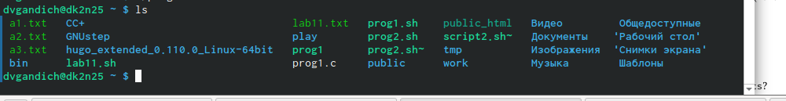{ #fig:010 width=90% }

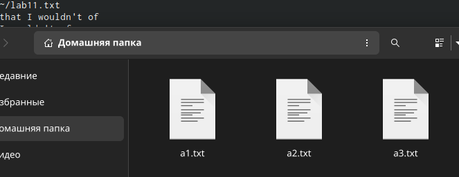{ #fig:011 width=90% }

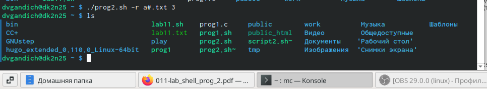{ #fig:012 width=90% }

8. Написать командный файл, который с помощью команды tar запаковывает в архив все файлы в указанной директории. Модифицировать его так, чтобы запаковывались только те файлы, которые были изменены менее недели тому назад (использовать команду find).

9. Делаем все то же самое, проверкой будет созданный архив формата tar

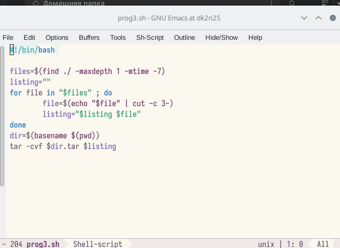{ #fig:013 width=90% }

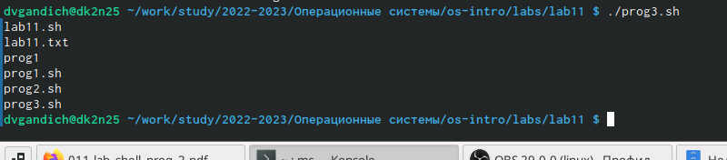{ #fig:014 width=90% }

{ #fig:015 width=90% }

# Вывод
Мы изучили основы программирования в оболочке Linux, научились писать более сложные командные файлы, используя разные управляющие конструкции и циклы

::: {#refs}
:::
