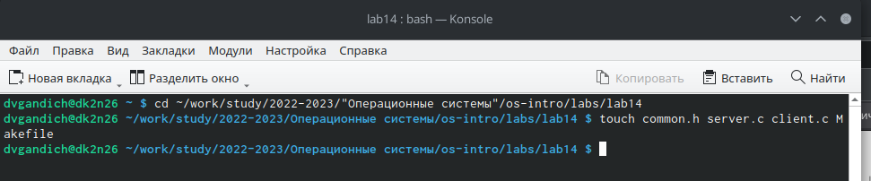
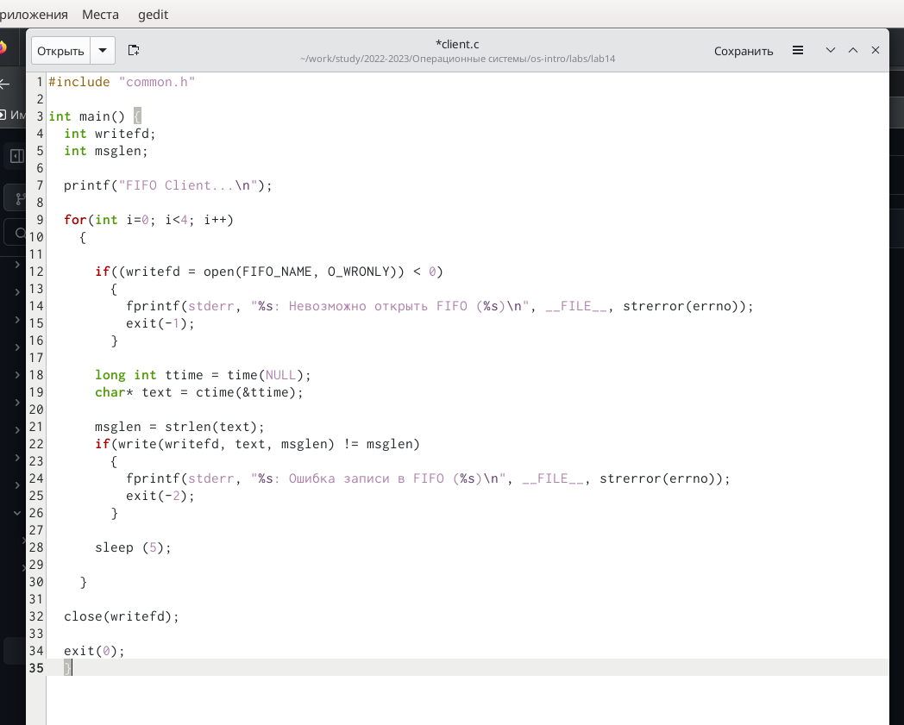
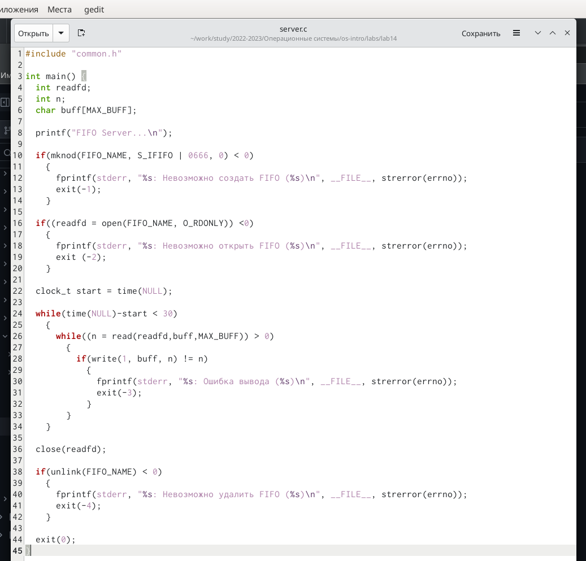
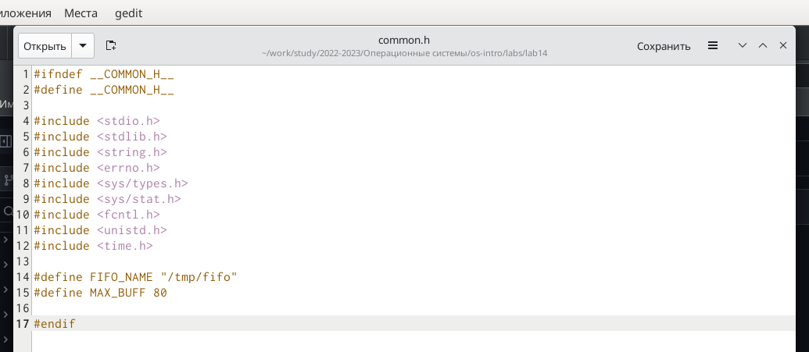
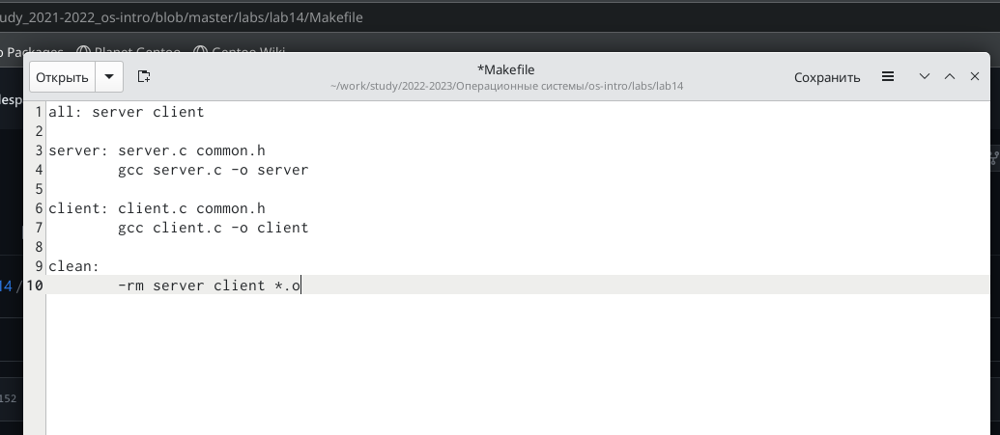
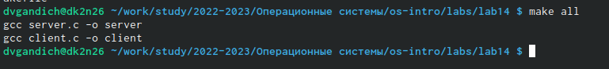
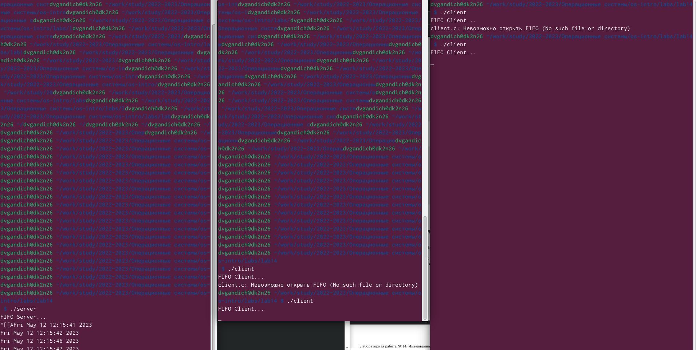

---
## Front matter
lang: ru-RU
title: Лабороторная работа №14
subtitle: Именованные каналы
author:
  - Гандич Дарья Владимировна
institute:
  - Российский университет дружбы народов, Москва, Россия
date: 12 мая 2023 г.

## i18n babel
babel-lang: russian
babel-otherlangs: english

## Formatting pdf
toc: false
toc-title: Содержание
slide_level: 2
aspectratio: 169
section-titles: true
theme: metropolis
header-includes:
 - \metroset{progressbar=frametitle,sectionpage=progressbar,numbering=fraction}
 - '\makeatletter'
 - '\beamer@ignorenonframefalse'
 - '\makeatother'
---

# Информация

## Докладчик

:::::::::::::: {.columns align=center}
::: {.column width="70%"}

  * Гандич Дарья Владимировна
  * студентка группы НБИбд-02-22
  * Российский университет дружбы народов
  
:::
::: {.column width="30%"}

:::
::::::::::::::

# Вводная часть

## Цели и задачи

Приобретение практических навыков работы с именованными каналами.

## Содержание исследования

1. Изучите приведённые в тексте программы server.c и client.c. Взяв данные примеры
за образец, напишите аналогичные программы, внеся следующие изменения:
* Работает не 1 клиент, а несколько (например, два).
* Клиенты передают текущее время с некоторой периодичностью (например, раз в пять
секунд). Используйте функцию sleep() для приостановки работы клиента.
* Сервер работает не бесконечно, а прекращает работу через некоторое время (напри-
мер, 30 сек). Используйте функцию clock() для определения времени работы сервера.

##

2. Создаем файлы common.h, server.c, client.c, Makefile.

{ #fig:001 width=90% }

##

3. Вбиваем тексты кода в файлы, меняя их по требованию задания

{ #fig:002 width=90% }

##

{ #fig:003 width=90% }

##

{ #fig:004 width=90% }

##

{ #fig:005 width=90% }

##

4. Запускаем все файлы командой make all

{ #fig:005 width=90% }

##

5. Проверяем работу сервера и клиентов

{ #fig:007 width=90% }

## Результаты

- Мы приобрели практические навыки работы с именованными каналами

## Итоговый слайд

мы молодцы!
:::
