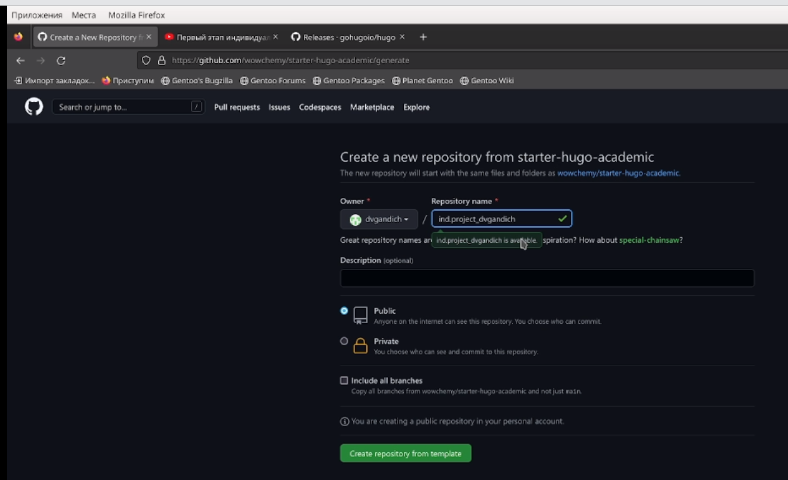
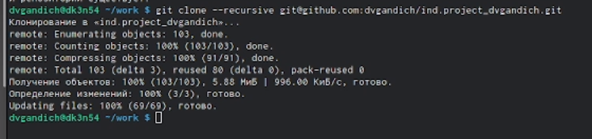
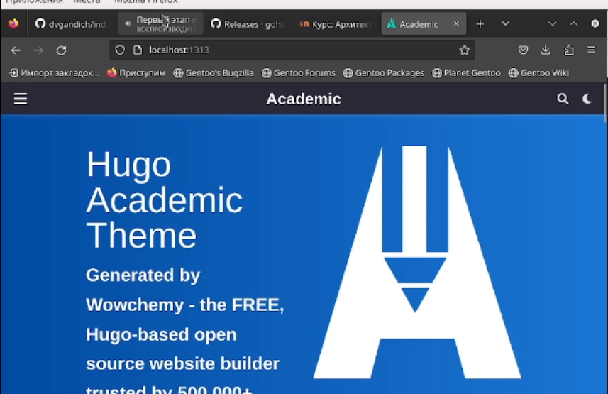
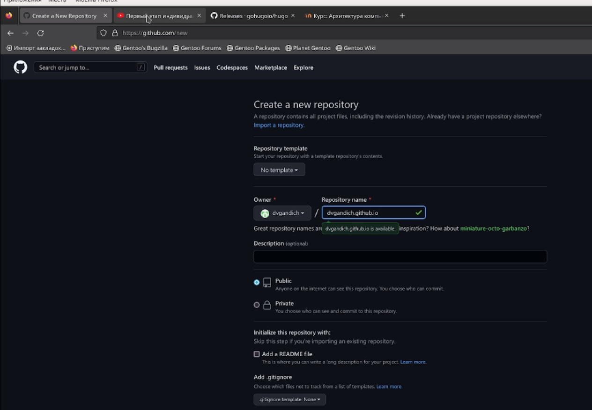
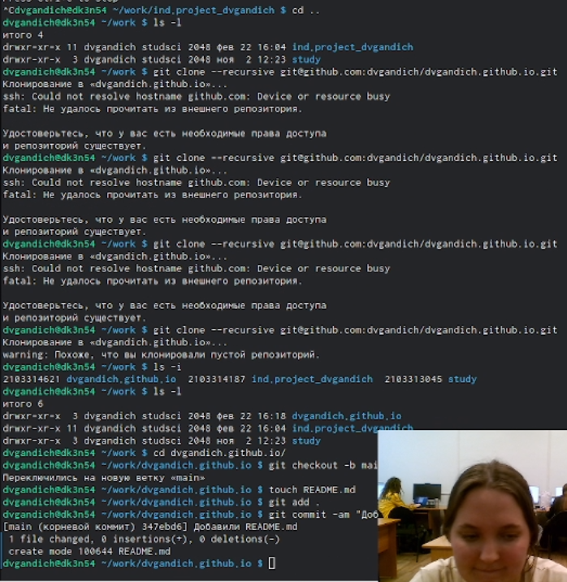
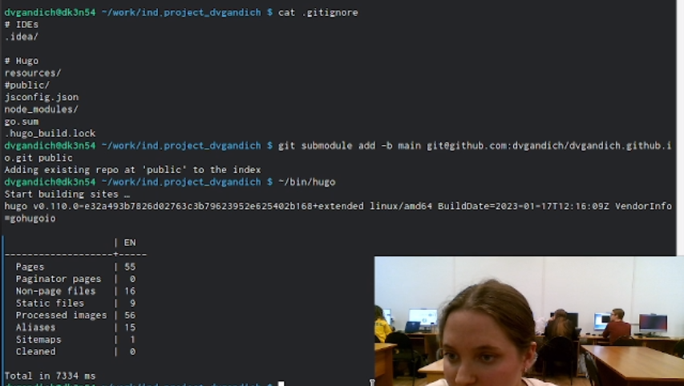
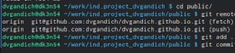
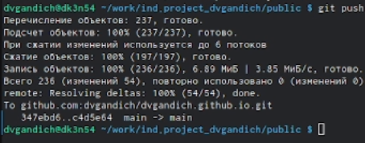
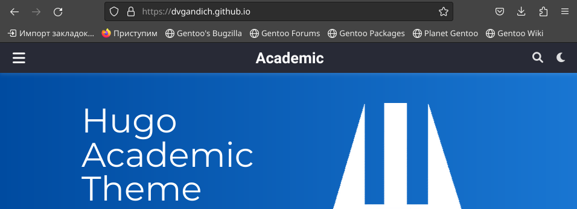

---
## Front matter
lang: ru-RU
title: Индивидуальный проект
subtitle: Первый этап
author:
  - Гандич Дарья Владимировна
institute:
  - Российский университет дружбы народов, Москва, Россия
date: 22 февраля 2023 г.

## i18n babel
babel-lang: russian
babel-otherlangs: english

## Formatting pdf
toc: false
toc-title: Содержание
slide_level: 2
aspectratio: 169
section-titles: true
theme: metropolis
header-includes:
 - \metroset{progressbar=frametitle,sectionpage=progressbar,numbering=fraction}
 - '\makeatletter'
 - '\beamer@ignorenonframefalse'
 - '\makeatother'
---

# Информация

## Докладчик

:::::::::::::: {.columns align=center}
::: {.column width="70%"}

  * Гандич Дарья Владимировна
  * студентка группы НБИбд-02-22
  * Российский университет дружбы народов
  
:::
::: {.column width="30%"}

:::
::::::::::::::

# Вводная часть

## Цели и задачи

- Создать первоначальный шаблон личного сайта

## Содержание исследования

1. Создаем репозиторий на основе шаблона в ТУИс
{#fig:004 width=90%}

##

2. Клонируем репозиторий, получаем ссылку на шаблон сайта.
{#fig:005 width=90%}

##

3. Вот так выглядит шаблон сайта:
{#fig:008 width=90%}

##

4. Создаем еще один репозиторий, чтобы наш сайт можно было открыть с любого ПК
{#fig:009 width=90%}

##

5. Снова клонируем созданный репозиторий, 
{#fig:010 width=90%}

##

6. Вносим в него недостающие папки, каталоги и файлы, подключаем основную ветку main
{#fig:013 width=90%}

##

7. Синхронизируем все выполненные действия с гитхабом.
{#fig:014 width=90%}

##

8. Получаем ссылку на личный сайт.
{#fig:015 width=90%}

##

9. Открываем наш сайт, пока еще пустой, но в дальнейшем мы это исправим!
{#fig:016 width=90%}

## Результаты

- Создали шаблон личного сайта
- Настроили репозитории для дальнейшего взаимодействия с сайтом

## Итоговый слайд

- Скоро мы настроим наш сайт, дополним его интересной информацией, а за этапами настройки вы будете следить вместе со мной!

:::

