---
## Front matter
title: "Индивидуальный проект"
subtitle: "Первый этап"
author: "Гандич Дарья Владимировна НБИбд-02-22"

## Generic otions
lang: ru-RU
toc-title: "Содержание"

## Bibliography
bibliography: bib/cite.bib
csl: pandoc/csl/gost-r-7-0-5-2008-numeric.csl

## Pdf output format
toc: true # Table of contents
toc-depth: 2
lof: true # List of figures
lot: true # List of tables
fontsize: 12pt
linestretch: 1.5
papersize: a4
documentclass: scrreprt
## I18n polyglossia
polyglossia-lang:
  name: russian
  options:
	- spelling=modern
	- babelshorthands=true
polyglossia-otherlangs:
  name: english
## I18n babel
babel-lang: russian
babel-otherlangs: english
## Fonts
mainfont: PT Serif
romanfont: PT Serif
sansfont: PT Sans
monofont: PT Mono
mainfontoptions: Ligatures=TeX
romanfontoptions: Ligatures=TeX
sansfontoptions: Ligatures=TeX,Scale=MatchLowercase
monofontoptions: Scale=MatchLowercase,Scale=0.9
## Biblatex
biblatex: true
biblio-style: "gost-numeric"
biblatexoptions:
  - parentracker=true
  - backend=biber
  - hyperref=auto
  - language=auto
  - autolang=other*
  - citestyle=gost-numeric
## Pandoc-crossref LaTeX customization
figureTitle: "Рис."
tableTitle: "Таблица"
listingTitle: "Листинг"
## Misc options
indent: true
header-includes:
  - \usepackage{indentfirst}
  - \usepackage{float} # keep figures where there are in the text
  - \floatplacement{figure}{H} # keep figures where there are in the text
---

# Цель работы

Создать первоначальный шаблон индивидуального сайта и сделать основную настройку репозиториев.

# Выполнение лабораторной работы

1. Первым делом скачиваем архив hugo, который соотвествует вашей ОС, создаем папку bin и переносим файл hugo в созданную папку.

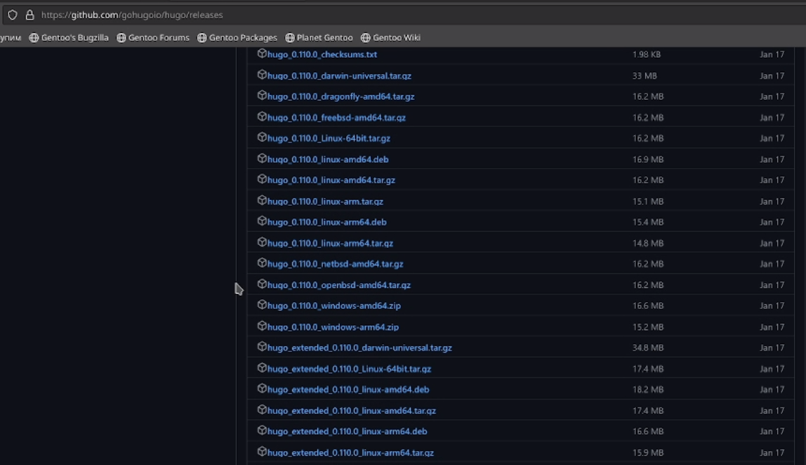{#fig:001 width=90%}
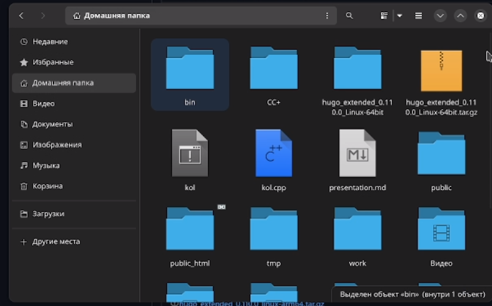{#fig:002 width=90%}

2. Создаем репозиторий на основе шаблона в ТУИС.
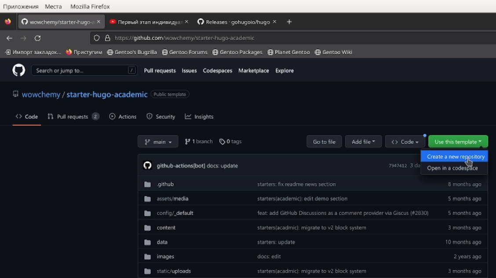{#fig:003 width=90%}
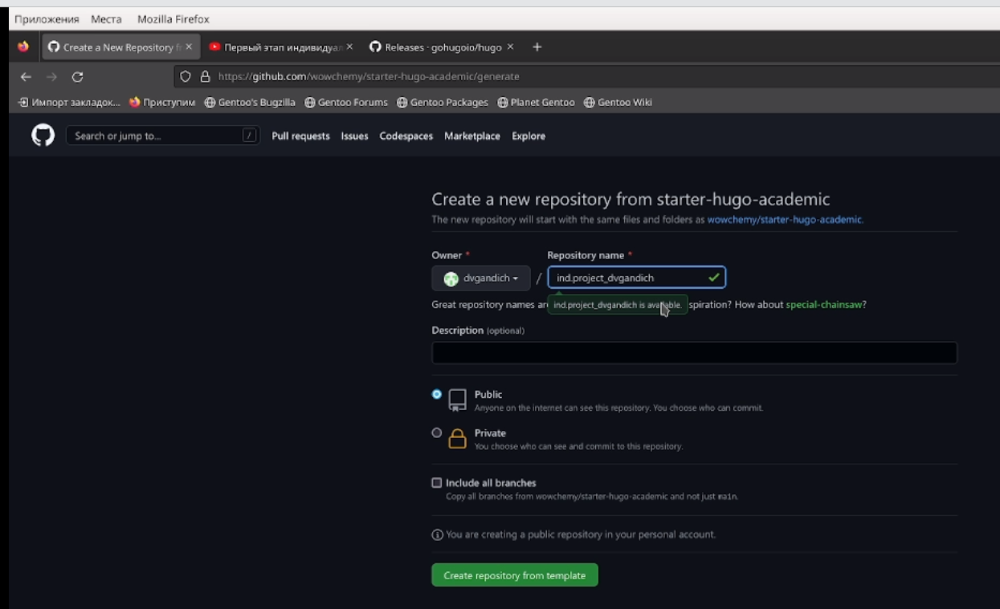{#fig:004 width=90%}

3. Клонируем шаблонный репозиторий в личный с помощью команды git clone
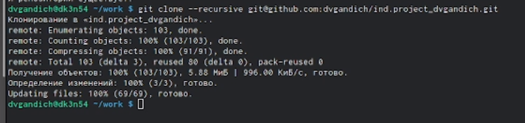{#fig:005 width=70%}

4. Просматриваем подкаталоги ~/bin/hugo и с помощью команды server получаем ссылку на шаблон сайта
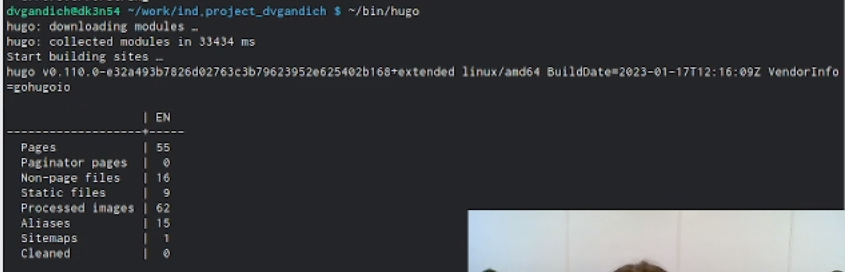{#fig:006 width=90%}
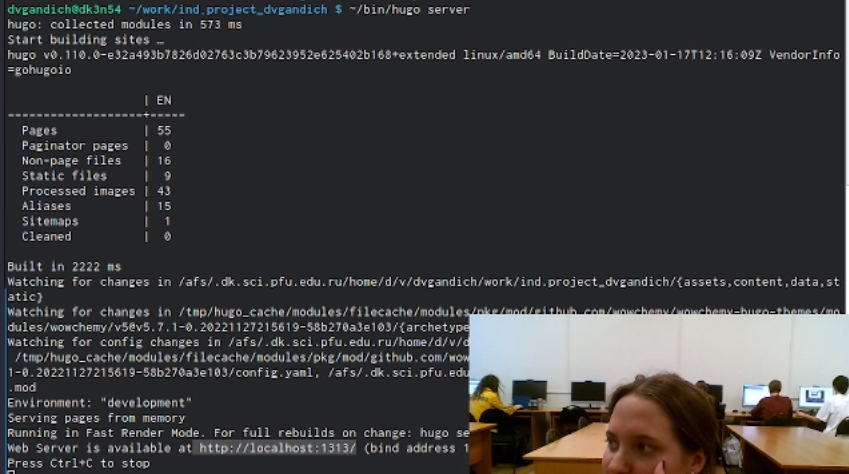{#fig:007 width=90%}
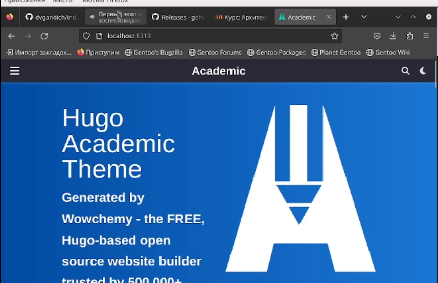{#fig:008 width=90%}

5. Создаем еще один репозиторий для того, чтобы сайт можно было открыть с любого ПК.
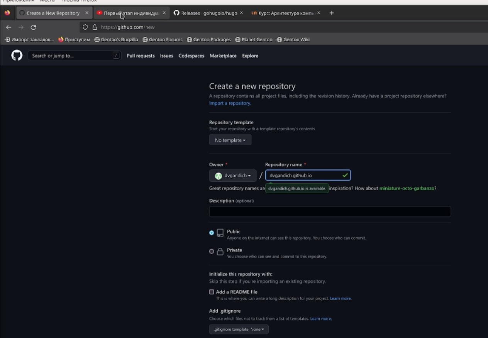{#fig:009 width=90%}

6. Снова клонируем ново-созданный репозиторий, переключаемся на ветку main, создаем файл md и выгружаем нововведения на github
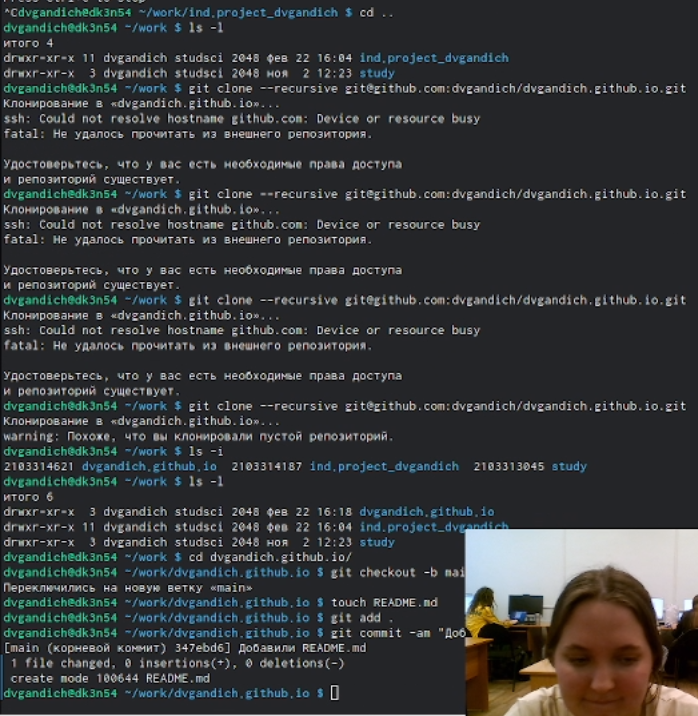{#fig:010 width=90%}

7. Переносим всю информацию на основную ветку с помощью команды git push origin main, добавляем новые подкаталоги на гитхаб, восстановив папку public 
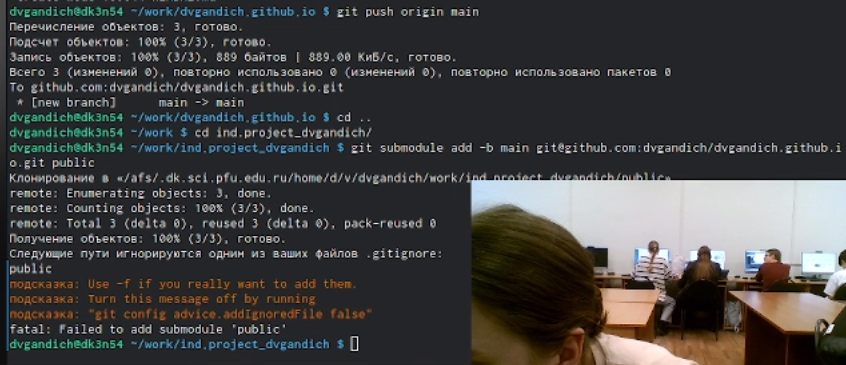{#fig:011 width=90%}
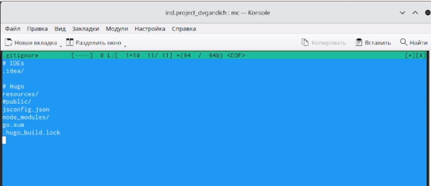{#fig:012 width=90%}
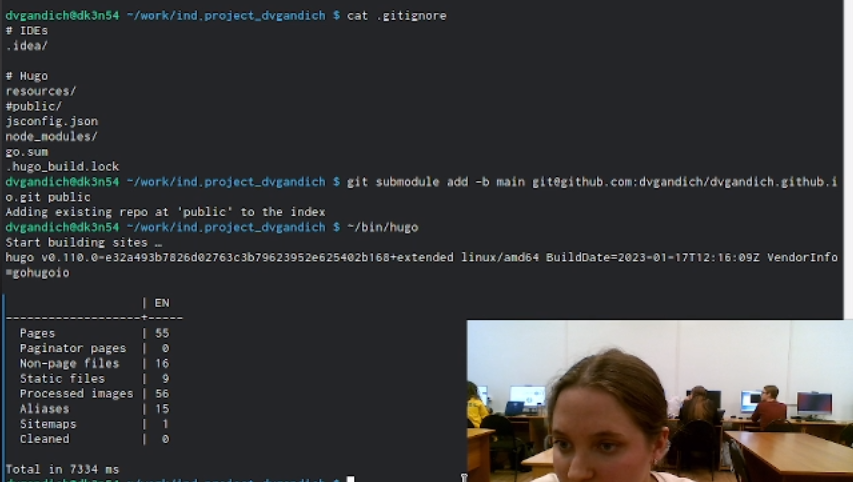{#fig:013 width=90%}

8. Проверяем привязку двух репозиториев к гитхабу и нашему профилю, обновляем репозиторий
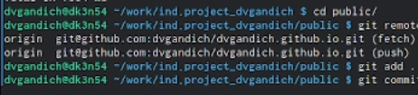{#fig:014 width=90%}
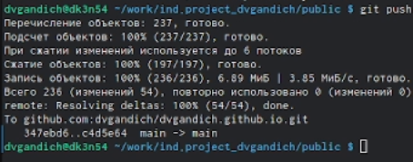{#fig:015 width=90%}

9. Заходим на личный сайт!
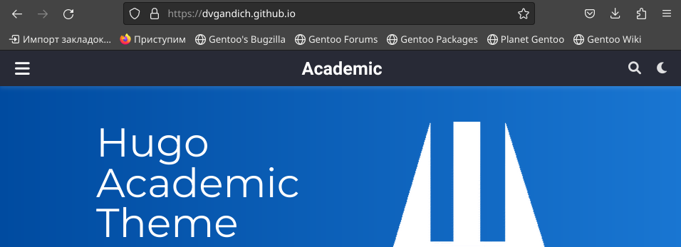{#fig:016 width=90%}

# Выводы

Мы создали шаблон для личного сайта, подвязали к нему репозитории и сделали первоначальную настройку шаблона.

::: {#refs}
:::
