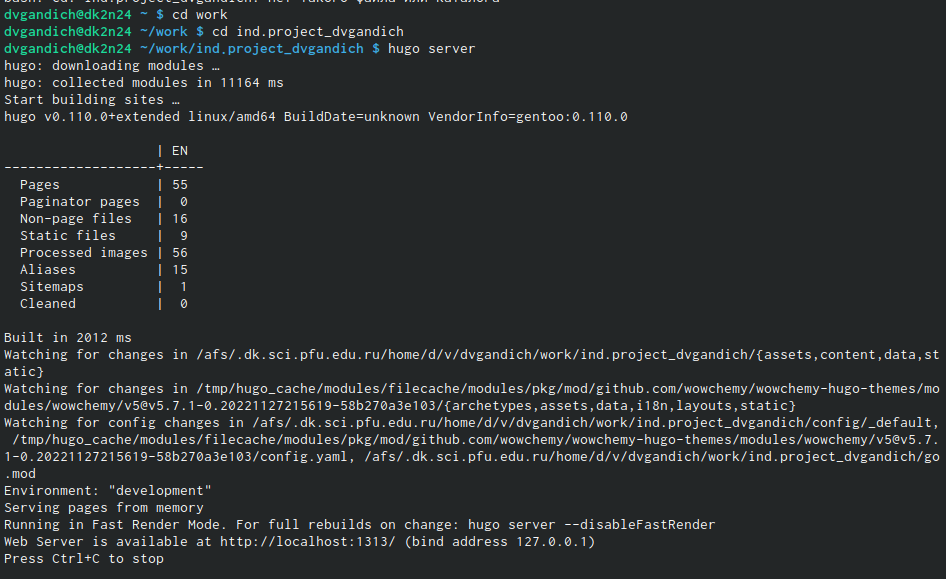
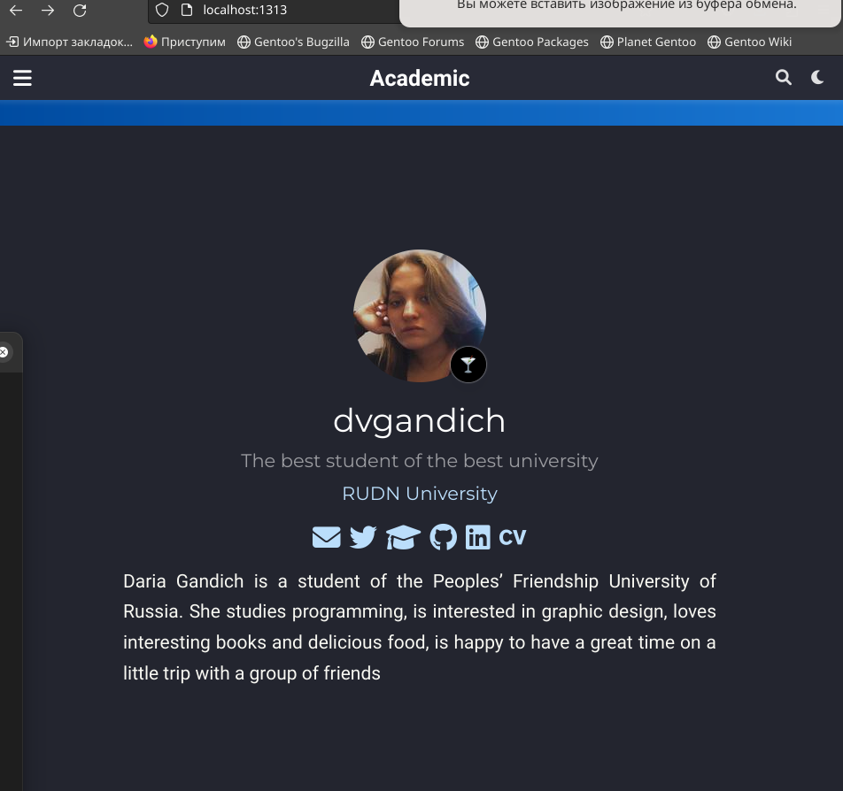
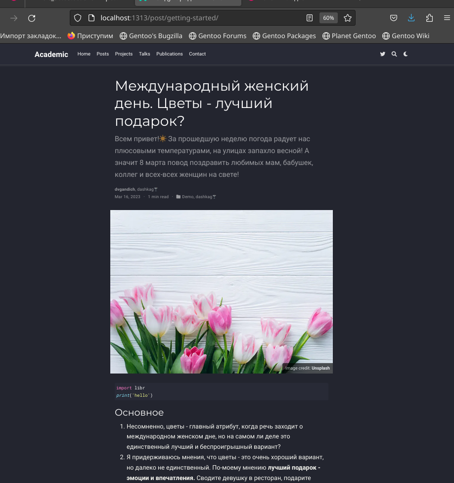
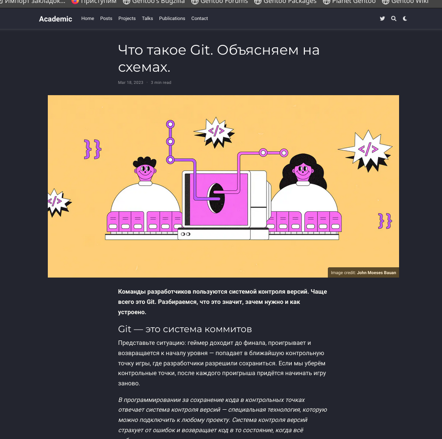

---
## Front matter
lang: ru-RU
title: Индивидуальный проект
subtitle: Второй этап
author:
  - Гандич Дарья Владимировна
institute:
  - Российский университет дружбы народов, Москва, Россия
date: 18 марта 2023 г.

## i18n babel
babel-lang: russian
babel-otherlangs: english

## Formatting pdf
toc: false
toc-title: Содержание
slide_level: 2
aspectratio: 169
section-titles: true
theme: metropolis
header-includes:
 - \metroset{progressbar=frametitle,sectionpage=progressbar,numbering=fraction}
 - '\makeatletter'
 - '\beamer@ignorenonframefalse'
 - '\makeatother'
---

# Информация

## Докладчик

:::::::::::::: {.columns align=center}
::: {.column width="70%"}

  * Гандич Дарья Владимировна
  * студентка группы НБИбд-02-22
  * Российский университет дружбы народов
  
:::
::: {.column width="30%"}

:::
::::::::::::::

# Вводная часть

## Цели и задачи

- Добавить к сайту данные о себе (фотографию, краткое описание владельца, информацию об интересах и образовании). Сделаь 2 поста.

## Содержание исследования

1. Переходим в каталог нашего проекта, вводим команду hugo server, получаем ссылку на сайт и начинаем работать с ним, не завершая процесс hugo server
{#fig:001 width=90%}

##

2. Добавляем на сайт фотографию и краткую информацию о себе. Добавляем ссылку на университет.
{#fig:003 width=90%}

##

3. Создаем пост о прошедшей неделе, тема моего поста - 8 марта и подарки девушкам.
{#fig:006 width=90%}
##

4. По такому же принципу создаем второй пост о контроль версии Git
{#fig:008 width=90%}

## Результаты

- Обновили фотографию пользователя
- Добавили краткую информацию о себе
- Написали два поста

## Итоговый слайд

- Наш личный сайт преображается, совсем скоро он полностью будет дополнен всей нужной информациейю.

:::

