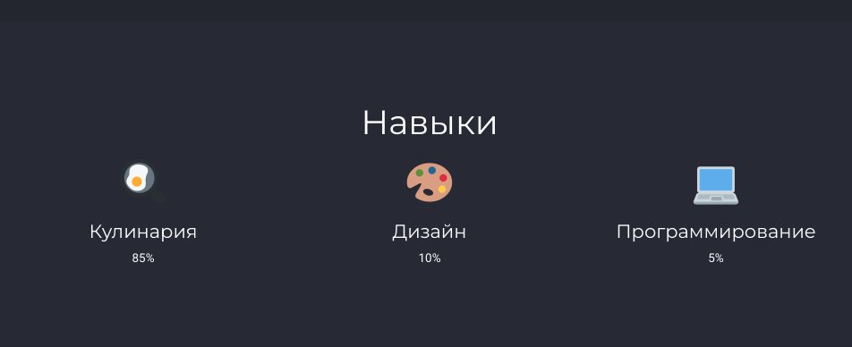
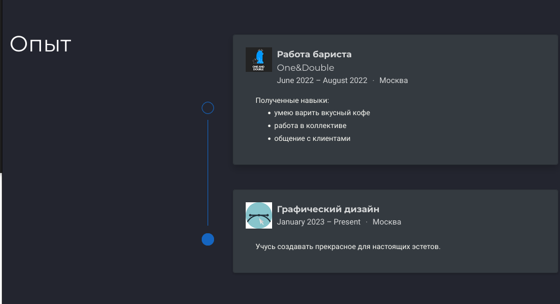
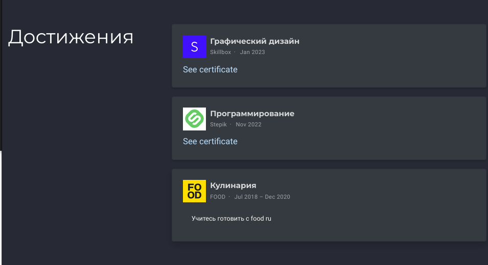
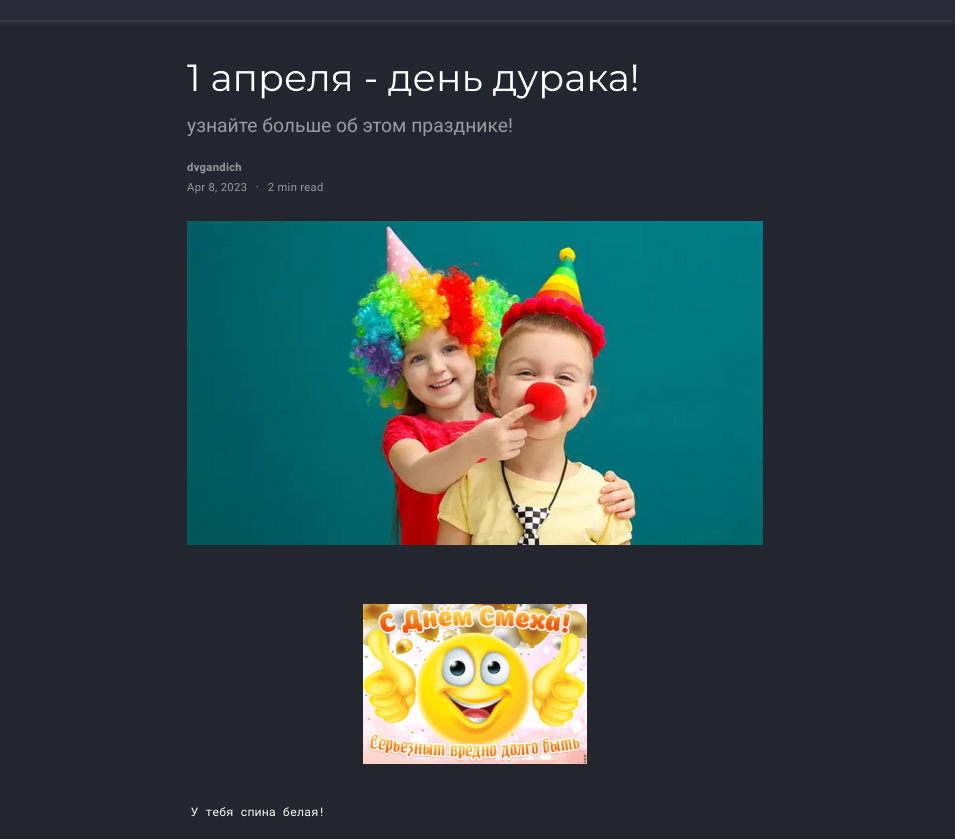
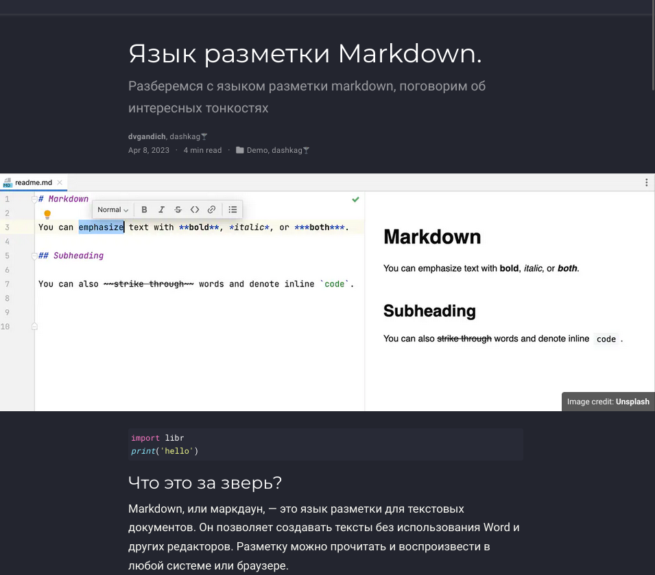

---
## Front matter
lang: ru-RU
title: Индивидуальный проект
subtitle: Третий этап
author:
  - Гандич Дарья Владимировна
institute:
  - Российский университет дружбы народов, Москва, Россия
date: 8 апреля 2023 г.

## i18n babel
babel-lang: russian
babel-otherlangs: english

## Formatting pdf
toc: false
toc-title: Содержание
slide_level: 2
aspectratio: 169
section-titles: true
theme: metropolis
header-includes:
 - \metroset{progressbar=frametitle,sectionpage=progressbar,numbering=fraction}
 - '\makeatletter'
 - '\beamer@ignorenonframefalse'
 - '\makeatother'
---

# Информация

## Докладчик

:::::::::::::: {.columns align=center}
::: {.column width="70%"}

  * Гандич Дарья Владимировна
  * студентка группы НБИбд-02-22
  * Российский университет дружбы народов
  
:::
::: {.column width="30%"}

:::
::::::::::::::

# Вводная часть

## Цели и задачи

- Добавить к сайту данные о себе (навыки, опыт, достижения). Сделаь 2 поста.

## Содержание исследования

1. Переходим в каталог нашего проекта, вводим команду hugo server, получаем ссылку на сайт и начинаем работать с ним, не завершая процесс hugo server

##

2. Добавляем на сайт информацию о навыках.

{#fig:001 width=90%}

##

3. Информацию об опыте

{#fig:002 width=90%}

##

4. Также добовляем информацию о достижениях

{#fig:003 width=90%}

##

5. Пишем пост о прошедшей неделе,я написала пост о празднике смеха и шуток

{#fig:004 width=90%}

##

6. Пишем пост о языке разметки markdown

{#fig:005 width=70%}

## Результаты

- Обновили информацию о навыках, опыте и достижения
- Написали два поста

## Итоговый слайд

- Наш личный сайт преображается, совсем скоро он полностью будет дополнен всей нужной информациейю.

:::

