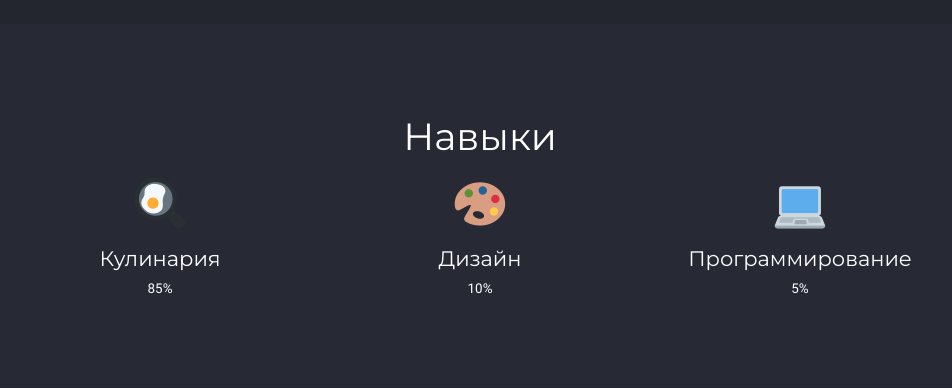
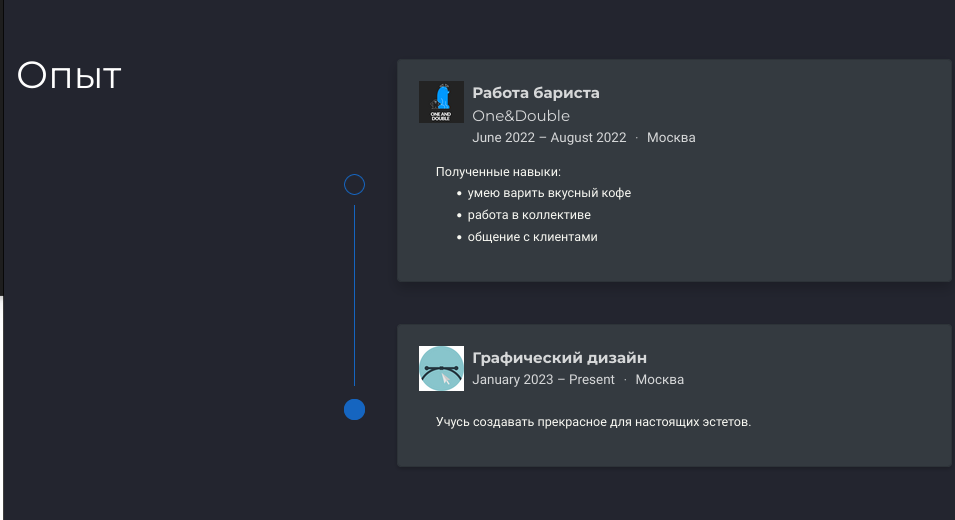
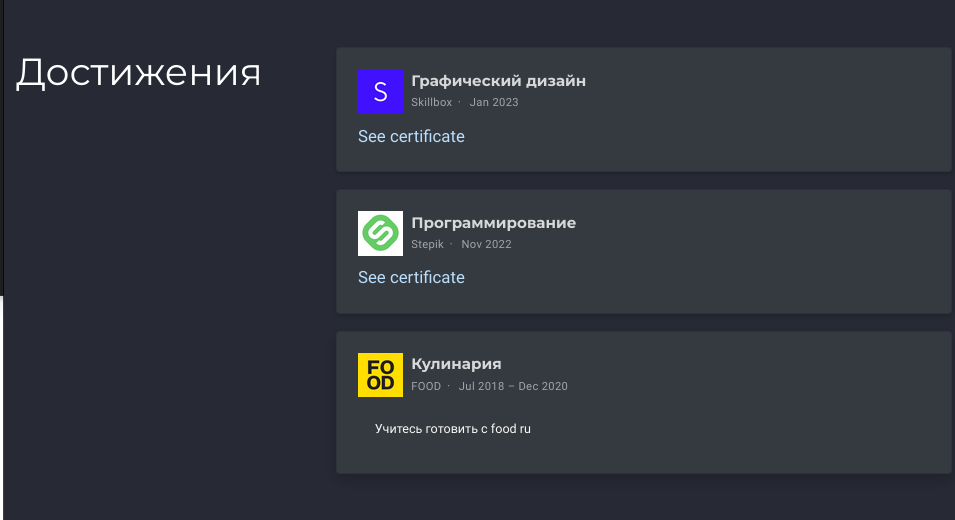
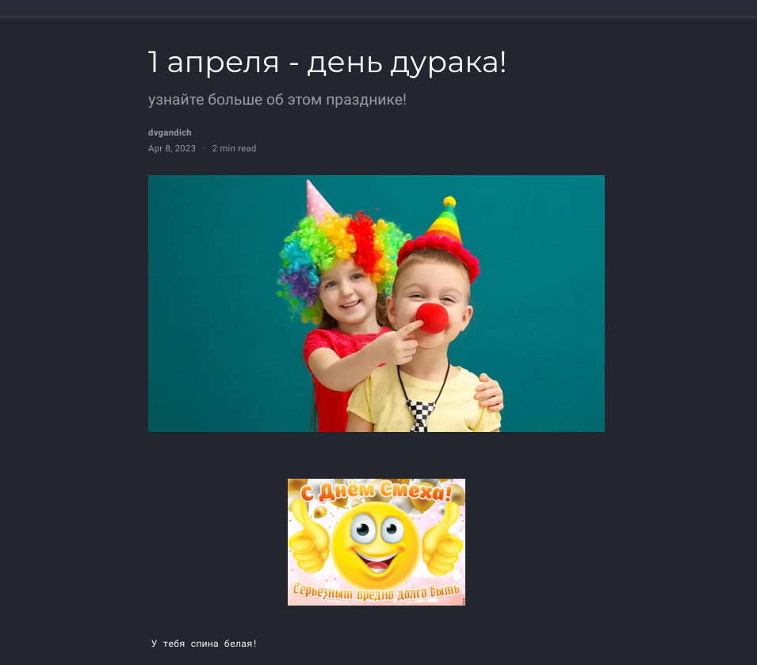
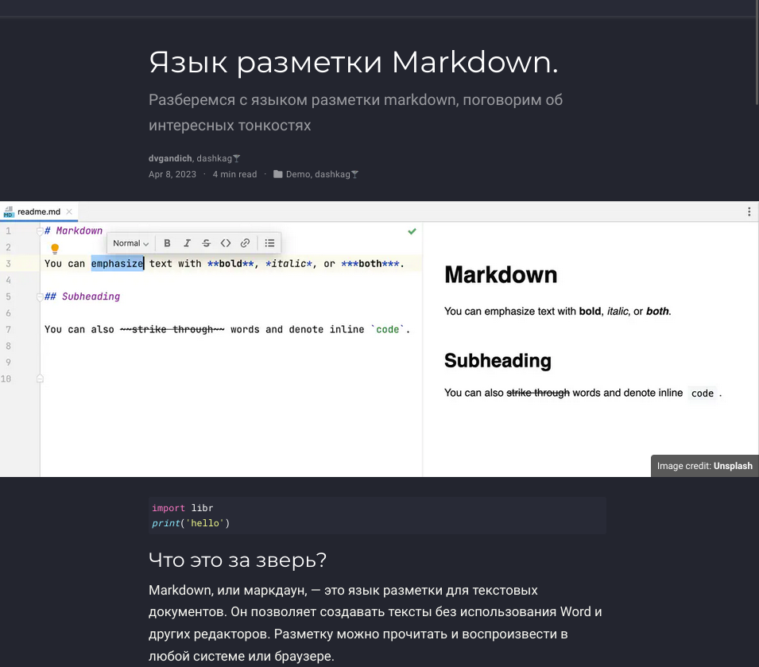

---
## Front matter
title: "Индивидуальный проект"
subtitle: "Третий этап"
author: "Гандич Дарья Владимировна НБИбд-02-22"

## Generic otions
lang: ru-RU
toc-title: "Содержание"

## Bibliography
bibliography: bib/cite.bib
csl: pandoc/csl/gost-r-7-0-5-2008-numeric.csl

## Pdf output format
toc: true # Table of contents
toc-depth: 2
lof: true # List of figures
lot: true # List of tables
fontsize: 12pt
linestretch: 1.5
papersize: a4
documentclass: scrreprt
## I18n polyglossia
polyglossia-lang:
  name: russian
  options:
	- spelling=modern
	- babelshorthands=true
polyglossia-otherlangs:
  name: english
## I18n babel
babel-lang: russian
babel-otherlangs: english
## Fonts
mainfont: PT Serif
romanfont: PT Serif
sansfont: PT Sans
monofont: PT Mono
mainfontoptions: Ligatures=TeX
romanfontoptions: Ligatures=TeX
sansfontoptions: Ligatures=TeX,Scale=MatchLowercase
monofontoptions: Scale=MatchLowercase,Scale=0.9
## Biblatex
biblatex: true
biblio-style: "gost-numeric"
biblatexoptions:
  - parentracker=true
  - backend=biber
  - hyperref=auto
  - language=auto
  - autolang=other*
  - citestyle=gost-numeric
## Pandoc-crossref LaTeX customization
figureTitle: "Рис."
tableTitle: "Таблица"
listingTitle: "Листинг"
## Misc options
indent: true
header-includes:
  - \usepackage{indentfirst}
  - \usepackage{float} # keep figures where there are in the text
  - \floatplacement{figure}{H} # keep figures where there are in the text
---

# Цель работы

Добавить к сайту данные о себе (навыки, опыт, достижения). Сделаь 2 поста.

# Выполнение лабораторной работы

1. Переходим в каталог нашего проекта, вводим команду hugo server, получаем ссылку на сайт и начинаем работать с ним, не завершая процесс hugo server

2. Добавляем на сайт информацию о навыках.

{#fig:001 width=90%}

3. Информацию об опыте

{#fig:002 width=90%}

4. Также добовляем информацию о достижениях

{#fig:003 width=90%}

5. Пишем пост о прошедшей неделе,я написала пост о празднике смеха и шуток

{#fig:004 width=90%}

6. Пишем пост о языке разметки markdown

{#fig:005 width=70%}

# Выводы

Мы дополнили сайт некоторой информацией о себе и написали два поста.

::: {#refs}
:::
